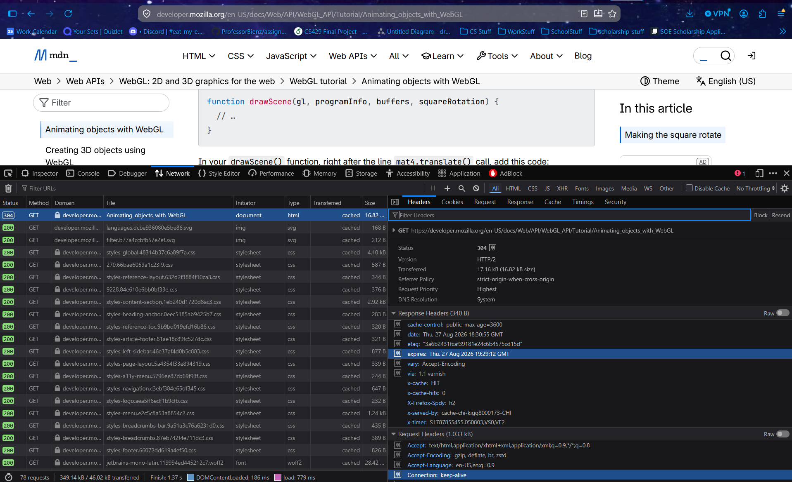
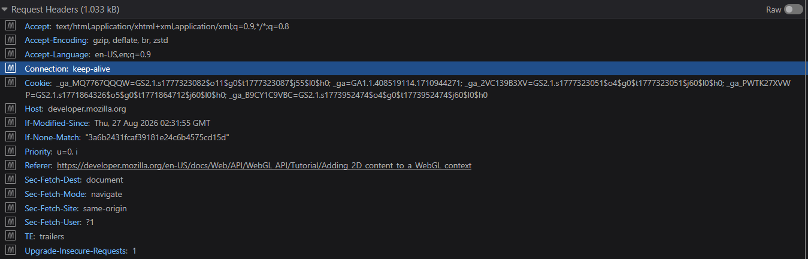

# HW 2

## Q1

Steps:

1. Open your browser's developer tools (right-click anywhere on a webpage and select "Inspect," then click the "Network" tab)
2. Reload the page, then click on the main GET request near the top, the one matching the page's own URL (if you use a website with a lot of dynamic elements, you may have to scroll a lot)
3. Referencing the details panel that opens on the right, answer:
    1. What status code did the server return?
    2. What version of HTTP is being used?
    3. Name one **request header** you see that we have not discussed in class, and take your best guess at what it does.
    4. Based on what you see, does the connection look persistent or non-persistent? Explain your reasoning.
    5. Upload a screenshot of the webpage and the detail view of the GET request.

### A1

For this page (since it happened to be open): https://developer.mozilla.org/en-US/docs/Web/API/WebGL_API/Tutorial/Animating_objects_with_WebGL

1. Status code 304 -- Not Modified; returned when I ask a cache server, and it sends a conditional GET to the source server for a GET if it's been modified since the Last Modified that was saved on last object storage.
   - Under request headers: If-Modified-Since Thu, 27 Aug 2026 02:31:55 GMT

2. Version of HTTP: HTTP/2
   - TODO: discuss this

3. If-None-Match "3a6b2431fcaf39181e24c6b4575cd15d"
   - response header has the same value under 
     - etag "3a6b2431fcaf39181e24c6b4575cd15d"
   - Best guess: maybe some sort of hashing for the object requested?
   - [correct answer: makes the get conditional](https://developer.mozilla.org/en-US/docs/Web/HTTP/Reference/Headers/If-None-Match?utm_source=devtools&utm_medium=devtools-netmonitor&utm_campaign=default)

4. Connection appears consistent using the clue of this request header:
   - Connection keep-alive

5. Screenshots

## Q2

Referring to Figure 2.4 in the textbook, notice that **none** of the listed applications require both no data loss and high time-sensitivity. Can you think of an application that would need both? In at least 5 sentences, describe the application and explain why it needs each property.

### A2

what is something that would need that both **no data loss** and **high time-sensitivity**

- emergency alert system? needs to make sure that all who need the communication receive (no data loss) and it needs to be quick in order for rapid reponse (high time-sensitivity)
  - security systems that contact police automatically?
- medical something? not sure what medical something would critically rely on the network though in a real world scenario

## Q3

In the exercise above, you considered how applications can differ in what they need from the network, for example how tolerant they are of losing data, or how sensitive they are to delay. Now imagine the network could treat traffic differently based on those needs, for instance by delivering a video call's data faster than an email's, or slowing down one app to speed up another.

Consider each of the following stakeholders getting to decide how the network treats different types of traffic:

+ Private companies
+ Individual users
+ Governments
+ Network engineers

For each stakeholder, name a **specific example** (for instance, what kind of company, or what kind of user), then give **one pro and one con** of that stakeholder holding this decision power.

Finally, which of the four do you think would be the **most fair approach**, and why?

### A3

/*
   **speed and data loss**

   assume network can treat data differently and get certain things delivered faster.
   specific example of stakeholder
   one pro of that person/org in power
   one con of that person/org in power
*/

**Private companies**

*Example*

A specific example of a private company stakeholder would be if Meta controlled network traffic flow/speeds/treatment of the Internet.

*Pro*

A pro of a private company (like Meta) being in control of traffic treatment is that their drive to be the top company in our capitalist society may drive them to constantly seek improvements to network traffic. Since another company could hypothetically come up with a solution for improvement and wrest control away from, say, Meta, Meta would have it in their best interest to keep innovating and improving, which would be a net benefit for users.

*Con*

A con of a private company (like Meta) being in control of traffic treatment is that traffic priority could be given to data that suits the company over other traffic. Following the Meta example, what if Facebook interaction (site/messaging) was given a higher priority over other similar sites, like X/Twitter. That's an example of something that would be more annoying than anything, but what if Facebook traffic was given priority over something more serious, like banking transactions or emergency alert services, and those service speeds were throttled over the network or data was lost in the name of priority given to the company in charge? As a further concern to traffic boosts for the company's purpose, they exist to make money, so there is nothing to stop a company for offering better usage to customers who are willing to pay more. This was a huge concern in the attempted acquisition of PNM by Blackstone that was recently in the New Mexico buzz (https://www.kob.com/new-mexico/opponents-supporters-sound-off-over-proposed-pnm-acquisition-by-blackstone/). Because private companies are driven by cutt-throat competition and money, they are a dangerous thing to have in charge of network traffic flow and expect them to alltruistically treat data equally or give priority to the "correct" thing. 

**Individual users**

*Example*

A specific example of an individual user stakeholder would be if all the students at UNM controlled network traffic flow/speeds/treatment at the UNM LAN.

*Pro*

A pro of individual users (like students) being in control of traffic treatment is that students could be in charge of priority of information speed and retention based on how close to a submission is to a deadline--faster and higher loss-prevention set by students submitting a panicked assignment at 11:59 PM. This could bring a better democratization to the network traffic among peers who share a common empathy.

*Con*

A con of individual users (like students) being in control of traffic treatment is trusting each user to be truthful about their needs. If we had 3 students on campus who came in to online game and deceitfully set a higher priority for their network traffic. This could potentially detract from traffic from other students who genuinely (and maybe desperately) need it. Unfortunately, people can easily talk themselves into prioritizing their needs over the group quite easily.

**Governments**

*Example*

A specific example of a governmental stakeholder would be if the US government (federal) controlled network traffic flow/speeds/treatment in the US.

*Pro*

A pro of a governmental body (like the federal US government) would be a standardization of network traffic expectations and infrastructure across the nation. This could be especially beneficial for people in rural areas without the most standard infrastructure (either using the DSL that has questionable speeds in their area, or nothing at all in that area). The government has the potential to conduct operations in the style of the New Deal in the Great Depression era to take on large scale public improvement projects, thus the large-scale standardization of network functionality is the largest perk to a controlling governmental body, in my opinion.

*Con*

A con of a governmental body (like the federal US governemnt) would be the flip-side of the pro above: what if the government was a corrupt body? It's an obvious point (and maybe more evident in our current controversial political climate in the US), but something that could affect everyone in the nation. There comes the possibility of marginalized communities having their speed throttled or data prioritization affected (increasing the data loss likelihood) just because that community is the one villified by that political power. There is a high potential for great improvement in encouraging a nation-wide standard; however, lately government bodies have proven to be remarkably fickle.

**Network engineers**

*Example*

A specific example of a network engineer stakeholder would be if there could be a governing body in the fashion of the Internet Engineering Task Force that controlled network traffic flow/speeds/treatment on a global scale.

*Pro*

A pro of a group of network engineers would be the focus on design and efficiency of network traffic. These people would be focused on scaleability, improvement of speed, and decrease in data loss when designing any changes to the system. Having this high level design made by people who understand networking at a fundamental level would be a net benefit for all, since good design in systems can only help the system function more smoothly for all.

*Con*

A con of a group of network engineers would be questionable funding of such an operation. This group would be a benefit to all who use the global network, but how are they being funded to make improvements, set standards, and anything else? These are not people likely doing this for charity--and likely we don't want them to because we need people who are solely motivated towards this task. Therefore, the group must be funded from something, and that something will have its own agendas--as mentioned about private companies and governments above. So, as ideal a situation it may seem, the goal may be corrupted by where the money flows from.

**Most fair approach**

Obviously, all approaches have their problems. I personally think that the network engineers would be the most fair approach, given that it would be run by people who understand the technical pieces, have a just interest in improvements, with hypothetically no ulterior motives (unless, as mentioned, influenced by a funder). A company is so driven by profit that it feels very dangerous to put them in charge of something that is practically a necessity to survive in our society now. A government, likewise, easily can sway to the political climate of the nation, which can easily turn on any group of people in a negative way. A group of users sounds like a nice idea in theory--especially the democratic aspect of it--but it feels like it would end up being like herding cats; each person will have their motives and may let their priorities win over the needs of the group as a whole. At least if a standard group of technically knowledgable people had control, and not for profit or political prowess, it feels like the most fair approach for users across the nation from an objective standpoint. 

## Q4

Did you use Generative AI for this assignment? If so, how?

### A4

I did not use GenAI for this assignment.