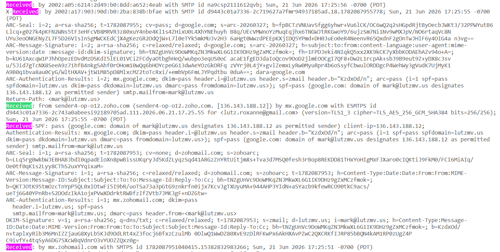

# HW 3

## Q1

This question walks you through investigating DNS yourself.

a. What is a whois database?

b. Use a whois database to find the names of two DNS servers for a domain of your choice. Which whois database did you use?

c. Use nslookup on your own computer to query three DNS servers, your default (local) DNS server and the two servers you found in part (b), for records of type A, NS, and MX for that domain. Summarize what you found, and note any differences between the three servers' answers. 

### A1

**(a)** A whois database (or system of databases) containes the identifying information about the registrant and metadata of ownership of a domain. The database is somewhat of a phonebook for registered domains; it contains information like the domain, when it was registered, its different name servers (readable names of the authoritative servers), and information about the registrar/registrant of the domain name (how to contact, etc). It is open information for the public to view about a specific domain name, but not to be confused with an actual DNS query. It is instead a query to a public, decentralized system of databases with information maintained by registrars/registries.

Further, just to vocalize the distinction, `whois` is the protocol to access information in the `whois` database.

Some sources:

[IPXO](https://www.ipxo.com/blog/what-is-whois/)

[Wiki](https://en.wikipedia.org/wiki/WHOIS)

**(b)** *Domain searched:* 

studiox.com

*Database used:* 

[ICANN lookup](https://lookup.icann.org/en/lookup)

*Nameservers (2):*

RORY.NS.CLOUDFLARE.COM
SERENA.NS.CLOUDFLARE.COM

As an aside, these nameservers are the listing of the authoritative server names for this domain. 

I also tried the whois database: https://www.whois.com/whois/studiox.com

And there are some differences in the entires. As an example, the whois database is missing the field "About the Registrar" contained in the ICANN lookup, which links to a URL for the registrar TUCOWS. Generally, to compare, the ICANN lookup feels more standardized and formatted better, including fields even if the information is redacted (shows text: "(The RDAP server redacted a part of the value)"). 

The above is an interesting notice. According to some additional research, in 2013, ICANN attempted a motion to rid of the whois protocol, claiming that registrar/registrant information should be disseminated only in specific situations such as sales; this was decried as a unjustified limitation of information access, especially by journalists who used it for learning the sources of information. However, it appears that ICANN pushed forward in this agenda. There has been a major shift over to RDAP instead, which returns whois-style data but in a structured JSON format and uses HTTP/HTTPS ports 80/443 instead of port 43 (TCP). The main benefits touted of this new protocol are the added structure, security of HTTPS, and ability to redact information the registrar/registrant does not want publicly accessible. It does however have native support for "tiered access", which can be configured server side to restrict data for different users, which is still the center of information freedom controversies as mentioned before.

[Interesting read on the above topic.](https://kmcd.dev/posts/whois-from-scratch/)
[Further sourcing.](https://www.dynadot.com/hub/domain-management/whois-vs-rdap)

**(c)**

*Query 1: Default Nameserver*

Following command run: 

```
nslookup -type=A studiox.com; nslookup -type=NS studiox.com; nslookup -type=MX studiox.com
```

Output:

```
Server:  unm-ns2.unm.edu
Address:  10.3.33.10

// A
Non-authoritative answer:
Name:    studiox.com
Addresses:  104.21.19.241
          172.67.190.127

Server:  unm-ns2.unm.edu
Address:  10.3.33.10

// NS
Non-authoritative answer:
studiox.com     nameserver = serena.ns.cloudflare.com
studiox.com     nameserver = rory.ns.cloudflare.com

rory.ns.cloudflare.com  internet address = 108.162.195.166
rory.ns.cloudflare.com  internet address = 162.159.44.166
rory.ns.cloudflare.com  internet address = 172.64.35.166
serena.ns.cloudflare.com        internet address = 108.162.192.220
serena.ns.cloudflare.com        internet address = 172.64.32.220
serena.ns.cloudflare.com        internet address = 173.245.58.220

Server:  unm-ns2.unm.edu
Address:  10.3.33.10

// MX
Non-authoritative answer:
studiox.com     MX preference = 0, mail exchanger = mail.studiox.com
```

*Query 2: rory.ns.cloudflare.com*

Following command run: 

```
nslookup -type=A studiox.com rory.ns.cloudflare.com; nslookup -type=NS studiox.com rory.ns.cloudflare.com; nslookup -type=MX studiox.com rory.ns.cloudflare.com
```

Output: 

```
Server:  rory.ns.cloudflare.com
Address:  162.159.44.166

// A
Name:    studiox.com
Addresses:  104.21.19.241
          172.67.190.127

Server:  rory.ns.cloudflare.com
Address:  162.159.44.166

// NS
studiox.com     nameserver = rory.ns.cloudflare.com
studiox.com     nameserver = serena.ns.cloudflare.com

Server:  rory.ns.cloudflare.com
Address:  162.159.44.166

// MX
studiox.com     MX preference = 0, mail exchanger = mail.studiox.com
mail.studiox.com        internet address = 205.174.25.155
```

*Query 3: serena.ns.cloudflare.com*

Following command run: 

```
nslookup -type=A studiox.com serena.ns.cloudflare.com; nslookup -type=NS studiox.com serena.ns.cloudflare.com; nslookup -type=MX studiox.com serena.ns.cloudflare.com
```

Output:

```
Server:  serena.ns.cloudflare.com
Address:  172.64.32.220

// A
Name:    studiox.com
Addresses:  104.21.19.241
          172.67.190.127

Server:  serena.ns.cloudflare.com
Address:  172.64.32.220

// NS
studiox.com     nameserver = rory.ns.cloudflare.com
studiox.com     nameserver = serena.ns.cloudflare.com

Server:  serena.ns.cloudflare.com
Address:  172.64.32.220

// MX
studiox.com     MX preference = 0, mail exchanger = mail.studiox.com
mail.studiox.com        internet address = 205.174.25.155
```

*Summary and Differences*

To summarize what is generally returned: 
1. A record: Returns the host name and the IP address at which the host is located.
2. NS record: Returns the authoritative name server names that contain the IP address location of the host name.
3. MX record: Returns the name of the mail server, and the IP of the mail server.

Some differences between name servers/interesting things noted:
+ Non-Authoritative Answer
  + This is indicated only on the local DNS server. This indicates that we are not getting the information back on the *legitimate authoritative DNS server*, ie serena and rory cloudflare servers.
+ studiox.com returns 2 A record IPs 
  + From a little looking, this is the effect of Cloudflare being the DNS provider. Cloudflare essentially provides a proxy in which you are visiting a Cloudflare IP, and then only Cloudflare communicates with the raw host IP.
    + [Source thread](https://community.cloudflare.com/t/a-record-shows-2-ip-addresses-domain-not-adding/396127/6), [Proxy docs](https://developers.cloudflare.com/learning-paths/prevent-ddos-attacks/baseline/proxy-dns-records/#how-it-works)
+ MX record "mail.studiox.com" information is not returned by the default name server, but is by the official authoritatives.
  + We can try another nameserver to see if this is reproduced:
  ```
  $ nslookup -type=MX studiox.com 8.8.8.8
  Server:  dns.google
  Address:  8.8.8.8

  Non-authoritative answer:
  studiox.com     MX preference = 0, mail exchanger = mail.studiox.com
  ```
  + This suggests that unless you query the direct authoritative, there is not a second query for the A record of the mail server. From some reading, it appears that IP addresses are not allowed in MX records--only hostnames. So, best theory is that nslookup did a secondary query for the IP of mail.studiox.com, but only when going to the direct studiox.com authoritative server. See:
  ```
  $ nslookup -type=A mail.studiox.com 
  Server:  unm-ns2.unm.edu
  Address:  10.3.33.10

  Non-authoritative answer:
  Name:    mail.studiox.com
  Address:  205.174.25.155   // same IP returned from auth server
  ```
+ MX record information
  + MX preference: priority is typically used for load balancing (equal priority for 2 MX record servers) or prioritization (try this mail server first, but if it fails, try this one). Since the priority is 0 in this case, and there is only one MX record, we can likely assume this is because there is only one mail server, so the priority is essentially unused here, but 0 would be the highest priority over others (lowest number == highest priority).
  + mail exchanger: refers to the hostname that is the mail server in actuality for email addresses under example@studiox.com.

#### A1 notes


[non auth](https://serverfault.com/questions/413124/dns-nslookup-what-is-the-meaning-of-the-non-authoritative-answer)

+ queries a decentralized network of registration data bases mantained by domain registries, registrars....

## Q2

Consider a short, 10 meter link, over which a sender can transmit at a rate of 150 bits/sec in both directions. Suppose that packets containing data are 100,000 bits long, and packets containing only control (e.g., ACK or handshaking) information are 200 bits long, and that there are N parallel connections, each of which gets 1/N of the link bandwidth. Now consider the HTTP protocol, and suppose that each downloaded object is 100 Kbits long, and the initial downloaded object contains 10 referenced objects from the same server. **Would parallel downloads via parallel instances of non-persistent HTTP make sense in this scenario?** Now consider persistent HTTP. **Do you expect significant gains over the non-persistent case? Justify and explain your answer.** 

### A2

## Q3

Find an email you've recently received and look at its full header (most email clients have an option like "show original" or "view source" for this). Take a screenshot of the Received: header lines. How many Received: lines are there? For each one, briefly explain what it tells you about the path the message took to reach you. 

### A3

Screenshot:


As seen above, there are 5 total lines containing "Received". The received headers are the most recent first, so the below list starts from the bottom and works its way up (origin -> myself).

1. *Received: by mx.zohomail.com with SMTPS id 1782087951040415.15382832983266; Sun, 21 Jun 2026 17:25:51 -0700 (PDT)*

This is the initial sending of Mark (sender) to his mail server (mx.zohomail.com), using SMTPS. It appears the domain name 'mx.zohomail.com' is a domain name for the mail server used.

2. *Received-SPF: pass (google.com: domain of mark@lutzmv.us designates 136.143.188.12 as permitted sender) client-ip=136.143.188.12;*

Briefly, SPF is an email authentication protocol in which you can authorize specific domains to send mail on behalf of your domain. This aligns with what is seen in (1); by doing an nslookup:

```
> nslookup 136.143.188.12
Server:  UnKnown
Address:  192.168.10.1

Name:    sender4-op-o12.zoho.com
Address:  136.143.188.12
```

We see it is sending through the 'zoho.com' domain, clearly a mail server for sending mail out. So, this step implies that google.com (the mail is in my Gmail account) has received the SMTPS and has run a preliminary check on Mark's TXT records to see if zoho has been authorized to send mail on his behalf. We can see the TXT record here, confirming the "pass":

```
> nslookup -type=TXT lutzmv.us
Server:  UnKnown
Address:  192.168.10.1

Non-authoritative answer:
lutzmv.us       text =

        "v=spf1 include:zoho.com ~all"
```

3. *Received: from sender4-op-o12.zoho.com (sender4-op-o12.zoho.com. [136.143.188.12]) by mx.google.com with ESMTPS id d9443c01a7336-2c743a0abeesi92189705ad.111.2026.06.21.17.25.55 for <lutz.roxanne@gmail.com> (version=TLS1_3 cipher=TLS_AES_256_GCM_SHA384 bits=256/256); Sun, 21 Jun 2026 17:25:55 -0700 (PDT)*

Once the SPF check has passed, official receipt and acceptance of the message occurs (that way if SPF check fails, data can be outright rejected without even accepting). We see confirmation of the sending domain we found from the reverse IP nslookup ('sender4-op-o12.zoho.com'); and we see that the message has been received my Google's mail servers: 'mx.google.com' for my receipt ('lutz.roxanne@gmail.com').

4. *X-Received: by 2002:a17:903:90d:b0:2ba:838b:bfae with SMTP id d9443c01a7336-2c719627a7fmr94937185ad.18.1782087955778; Sun, 21 Jun 2026 17:25:55 -0700 (PDT)*

X-Received is a non-standard header used for internal records or internal server passing information. So likely an internal tracking of some movement within Google's mail servers.

[A source on X-headers generally.](https://dmarceye.com/glossary/x-headers)

5. *Received: by 2002:a05:6214:2d49:b0:8dd:a652:4eab with SMTP id na9csp2111612qvb; Sun, 21 Jun 2026 17:25:56 -0700 (PDT)*

The final receipt, and final indication that the message has arrived to the server with my mailbox. Successful delivery!


#### notes

also a note on X-

https://security.stackexchange.com/questions/103563/what-is-the-difference-between-x-received-and-received-in-email-header


## Q4

Suppose your department has a local DNS server used by everyone in the department, and you are an ordinary user, not a network or system administrator. Is there a way for you to determine whether an external website was likely accessed from a computer in your department within the last couple of seconds? Explain your reasoning. 

### A4

DNS uses UDP. So hypothetically, you could spy on unencrypted UDP traffic over the network to see DNS requests. Seeing if this is valid with WireShark.

#### notes

[udp used for dns protocol?](https://www.geeksforgeeks.org/computer-networks/why-does-dns-use-udp-and-not-tcp/)

## Q5

What is your GitHub username? (If you don't have one, please create it first, and then paste your username below)

### A5

rlutz1

## Q6

Did you use Generative AI for this assignment? If so, how?

### A6

I did not use GenAI for this assignment.