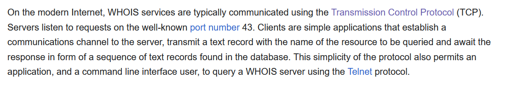

# HW 3

## Q1

This question walks you through investigating DNS yourself.

a. What is a whois database?

b. Use a whois database to find the names of two DNS servers for a domain of your choice. Which whois database did you use?

c. Use nslookup on your own computer to query three DNS servers, your default (local) DNS server and the two servers you found in part (b), for records of type A, NS, and MX for that domain. Summarize what you found, and note any differences between the three servers' answers. 

### A1

**(a)** A whois database (or system of databases) containes the identifying information about the registrant and metadata of ownership of a domain. The database is somewhat of a phonebook for registered domains; it contains information like the domain, when it was registered, its different name servers (readable names of the authoritative servers), and information about the registrar/registrant of the domain name (how to contact, etc). It is open information for the public to view about a specific domain name, but not to be confused with an actual DNS query. It is instead a query to a public, decentralized system of databases with information maintained by registrars/registries.

Further, just to vocalize the distinction, `whois` is the protocol to access information in the `whois` database.

Some sources:

[IPXO](https://www.ipxo.com/blog/what-is-whois/)

[Wiki](https://en.wikipedia.org/wiki/WHOIS)

**(b)** *Domain searched:* 

studiox.com

*Database used:* 

[ICANN lookup](https://lookup.icann.org/en/lookup)

*Nameservers (2):*

RORY.NS.CLOUDFLARE.COM
SERENA.NS.CLOUDFLARE.COM

As an aside, these nameservers are the listing of the authoritative server names for this domain. 

I also tried the whois database: https://www.whois.com/whois/studiox.com

And there are some differences in the entires. As an example, the whois database is missing the field "About the Registrar" contained in the ICANN lookup, which links to a URL for the registrar TUCOWS. Generally, to compare, the ICANN lookup feels more standardized and formatted better, including fields even if the information is redacted (shows text: "(The RDAP server redacted a part of the value)"). 

The above is an interesting notice. According to some additional research, in 2013, ICANN attempted a motion to rid of the whois protocol, claiming that registrar/registrant information should be disseminated only in specific situations such as sales; this was decried as a unjustified limitation of information access, especially by journalists who used it for learning the sources of information. However, it appears that ICANN pushed forward in this agenda. There has been a major shift over to RDAP instead, which returns whois-style data but in a structured JSON format and uses HTTP/HTTPS ports 80/443 instead of port 43 (TCP). The main benefits touted of this new protocol are the added structure, security of HTTPS, and ability to redact information the registrar/registrant does not want publicly accessible. It does however have native support for "tiered access", which can be configured server side to restrict data for different users, which is still the center of information freedom controversies as mentioned before.

[Interesting read on the above topic.](https://kmcd.dev/posts/whois-from-scratch/)
[Further sourcing.](https://www.dynadot.com/hub/domain-management/whois-vs-rdap)

**(c)**

*Query 1: Default Nameserver*

Following command run: 

```
nslookup -type=A studiox.com; nslookup -type=NS studiox.com; nslookup -type=MX studiox.com
```

Output:

```
Server:  unm-ns2.unm.edu
Address:  10.3.33.10

Non-authoritative answer:
Name:    studiox.com
Addresses:  104.21.19.241
          172.67.190.127

Server:  unm-ns2.unm.edu
Address:  10.3.33.10

Non-authoritative answer:
studiox.com     nameserver = serena.ns.cloudflare.com
studiox.com     nameserver = rory.ns.cloudflare.com

rory.ns.cloudflare.com  internet address = 108.162.195.166
rory.ns.cloudflare.com  internet address = 162.159.44.166
rory.ns.cloudflare.com  internet address = 172.64.35.166
serena.ns.cloudflare.com        internet address = 108.162.192.220
serena.ns.cloudflare.com        internet address = 172.64.32.220
serena.ns.cloudflare.com        internet address = 173.245.58.220
Server:  unm-ns2.unm.edu
Address:  10.3.33.10

Non-authoritative answer:
studiox.com     MX preference = 0, mail exchanger = mail.studiox.com
```

*Query 2: rory.ns.cloudflare.com*

Following command run: 

```
nslookup -type=A studiox.com rory.ns.cloudflare.com; nslookup -type=NS studiox.com rory.ns.cloudflare.com; nslookup -type=MX studiox.com rory.ns.cloudflare.com
```

Output: 

```
Server:  rory.ns.cloudflare.com
Address:  162.159.44.166

Name:    studiox.com
Addresses:  104.21.19.241
          172.67.190.127

Server:  rory.ns.cloudflare.com
Address:  162.159.44.166

studiox.com     nameserver = rory.ns.cloudflare.com
studiox.com     nameserver = serena.ns.cloudflare.com
Server:  rory.ns.cloudflare.com
Address:  162.159.44.166

studiox.com     MX preference = 0, mail exchanger = mail.studiox.com
mail.studiox.com        internet address = 205.174.25.155
```

*Query 3: serena.ns.cloudflare.com*

Following command run: 

```
nslookup -type=A studiox.com serena.ns.cloudflare.com; nslookup -type=NS studiox.com serena.ns.cloudflare.com; nslookup -type=MX studiox.com serena.ns.cloudflare.com
```

Output:

```
Server:  serena.ns.cloudflare.com
Address:  172.64.32.220

Name:    studiox.com
Addresses:  104.21.19.241
          172.67.190.127

Server:  serena.ns.cloudflare.com
Address:  172.64.32.220

studiox.com     nameserver = rory.ns.cloudflare.com
studiox.com     nameserver = serena.ns.cloudflare.com
Server:  serena.ns.cloudflare.com
Address:  172.64.32.220

studiox.com     MX preference = 0, mail exchanger = mail.studiox.com
mail.studiox.com        internet address = 205.174.25.155
```

*Summary and Differences*

[non auth](https://serverfault.com/questions/413124/dns-nslookup-what-is-the-meaning-of-the-non-authoritative-answer)


#### A1 notes



+ queries a decentralized network of registration data bases mantained by domain registries, registrars....

## Q2

Consider a short, 10 meter link, over which a sender can transmit at a rate of 150 bits/sec in both directions. Suppose that packets containing data are 100,000 bits long, and packets containing only control (e.g., ACK or handshaking) information are 200 bits long, and that there are N parallel connections, each of which gets 1/N of the link bandwidth. Now consider the HTTP protocol, and suppose that each downloaded object is 100 Kbits long, and the initial downloaded object contains 10 referenced objects from the same server. Would parallel downloads via parallel instances of non-persistent HTTP make sense in this scenario? Now consider persistent HTTP. Do you expect significant gains over the non-persistent case? Justify and explain your answer. 

### A2

## Q3

Find an email you've recently received and look at its full header (most email clients have an option like "show original" or "view source" for this). Take a screenshot of the Received: header lines. How many Received: lines are there? For each one, briefly explain what it tells you about the path the message took to reach you. 

### A3

## Q4

Suppose your department has a local DNS server used by everyone in the department, and you are an ordinary user, not a network or system administrator. Is there a way for you to determine whether an external website was likely accessed from a computer in your department within the last couple of seconds? Explain your reasoning. 

### A4

## Q5

What is your GitHub username? (If you don't have one, please create it first, and then paste your username below)


### A5

## Q6

Did you use Generative AI for this assignment? If so, how?

### A6