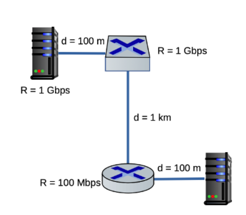

# HW 4

## Q1

Besides network-related considerations such as delay, loss, and bandwidth performance, there are other important factors that go into designing a **CDN server selection strategy.** **Identify at least two of these factors and explain them** (at least 5 sentences total).

### A1

1. Avoiding a single point of failure, or decentralization
2. Homogeneity -- ability to adapt to different user's network capabilities
3. Distance to users?
4. Repeat request traffic?

## Q2

Using the figure above, let's review delays from Chapter 1:

Assume all three links shown have a propagation speed of 2 x 10^8 m/s. Three 1000-byte packets are sent back-to-back (with no gap between them) from the host in the top left to the host in the bottom right. Assume each switch uses store-and-forward switching, meaning it must fully receive a packet before it can begin transmitting it out the next link.

How long does it take, from the moment Host A begins transmitting the first bit of the first packet, until the last bit of the third packet arrives at Host B?

Show your work, including any queuing delay you identify and at which device it occurs. (You may attach images to your answer).

### A2

## Q3

This question will walk you through internet governance/policy organizations.

Choose four (4) organizations from the following list (at least two of them must have international or multinational reach/jurisdiction):

    AFNIC
    APNIC
    Budapest Convention (Council of Europe)
    CISA
    Educause
    EFF
    FBI Cyber
    FCC
    ICANN
    IETF
    ITU
    NTIA
    RIPE NCC
    Verisign
    WIPO
    W3C

For each of your four chosen organizations, answer the following four questions. You may build your table using Canvas's built in table tool (Insert > Table) or the Markdown template provided below.

What type of organization? (Choose the single most relevant category) [technical standards, legal/policy, advocacy, registry/operator]
Reach and jurisdiction? [US-only, International/Multinational, Regional (outside US)]
What does it govern or influence? In 1 to 2 sentences, describe its primary function. Be specific (avoid simply restating its name or acronym).
Enforces power? [yes, no, indirectly]

Markdown template (copy and paste, then fill in each row):

| Organization | Category | Reach/Jurisdiction | What It Governs/Influences | Enforcement Power |
|---|---|---|---|---|
|  |  |  |  |  |
|  |  |  |  |  |
|  |  |  |  |  |
|  |  |  |  |  |

### A3

## Q4

Suppose a phishing website is used to defraud victims located in the United States. The website is hosted on a domain that was registered through a registrar based outside the US.

Using the four organizations you selected above, answer the following:

1. Based on the categories and jurisdictions you identified, which of your four organizations (if any) could plausibly get involved in responding to this situation? Explain why, referencing their category and enforcement power from your table. [3-5 sentences]

2. Are there any of your four organizations that could not meaningfully act in this scenario, despite being relevant to internet governance generally? Explain what limits them. [3-5 sentences]

### A4

## Q5

Did you use Generative AI for this assignment? If so, how?

### A5

I did not use GenAI for this assignment.