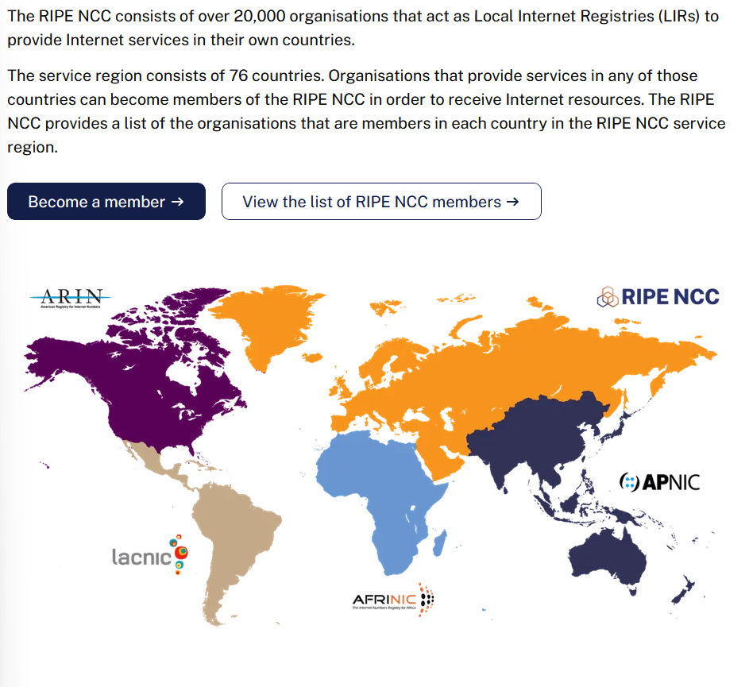
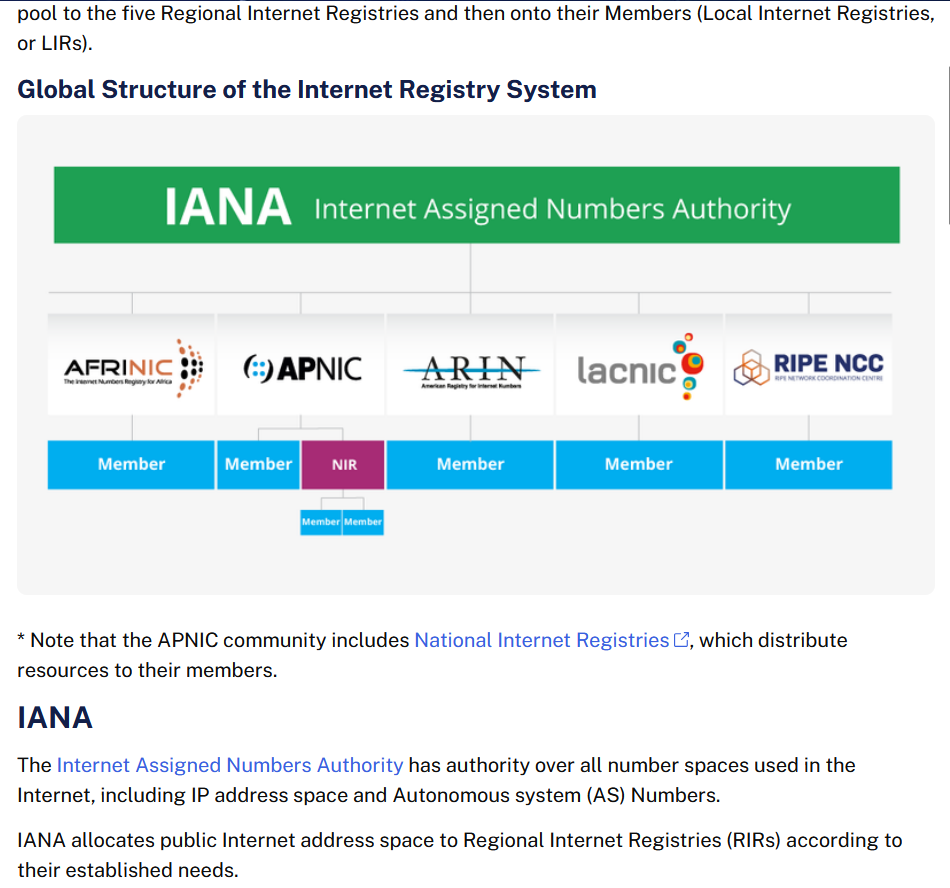

# HW 4

## Q1

Besides network-related considerations such as delay, loss, and bandwidth performance, there are other important factors that go into designing a **CDN server selection strategy.** **Identify at least two of these factors and explain them** (at least 5 sentences total).

*as in: what cdn server should you be pointed to for the content?*

### A1

1. Geographic proximity. 
If my client machine is geographically closer to a CDN server, then there is an implication of less time for that content to get to me over the network. The physical layer provides a real limitation in terms of actual distance data needs to travel over to get to a requester. The longer a distance to travel, the longer time it will take to get to me. This does not necessarily account for number of links that need to be travelled; it is very possible that the shortest-path is not actually the best path if there is a bottleneck link on the way.

2. Content on the server (items in cache).
If the closest server to you does not have the content, it may be in the best interest to redirect to a nearby server with the content requested rather than fetching it from the server. This could be seen most in Netflix's "push caching" model. Instead of making a client request resulting in a pull of the content from the origin server (given it is not on a cache server), it is probable that the CDN redirects the request to a server that does have the content. It may not necessarily worthwhile in a "pull cache" to do this, but if the content is rarely requested and for some reason the origin server takes a longer response, I do not think it's impossible to think that this is an option when selecting servers.

## Q2

Using the figure above, let's review delays from Chapter 1:

Assume all three links shown have a propagation speed of 2 x 10^8 m/s. Three 1000-byte packets are sent back-to-back (with no gap between them) from the host in the top left to the host in the bottom right. Assume each switch uses store-and-forward switching, meaning it must fully receive a packet before it can begin transmitting it out the next link.

How long does it take, from the moment Host A begins transmitting the first bit of the first packet, until the last bit of the third packet arrives at Host B?

Show your work, including any queuing delay you identify and at which device it occurs. (You may attach images to your answer).

### A2

**Assumptions Made to Note**
+ All packets "appear" at t = 0. They do not appear in a realistic P1 arrives at t = 0, and maybe P2 arrives at t = 0.5.
+ Systems and packet switches start transmitting a new packet the minute they are finished transmitting the current--all packets that arrive wait in queue until their transmission time is ready.
+ Packets are labelled P1, P2, P3 and sent in that order (P1 first, P3 last).

Below is the handwork done in completing the problem. The final drawing is how the queuing times were determined. It was most helpful to draw out a timeline here with time stamps to show the flow. So, please refer to that for work on the queue times.

Final answer: Total time for all 3 packets A -> B: **262 microseconds**

#### A2 aux notes

queueing was a little tricky, refer to the weird pic later. time unit microseconds

P1:
    t = 0, 1, 2: q = 0

P2: 
    t = 0: q = 8
    t = 1: q = 0
    t = 2: q = 72

P3:
    t = 0: q = 16
    t = 1: q = 0
    t = 2: q = 144

## Q3

This question will walk you through internet governance/policy organizations.

Choose four (4) organizations from the following list (at least two of them must have international or multinational reach/jurisdiction):

    AFNIC
    APNIC
    Budapest Convention (Council of Europe)
    CISA
    Educause
    EFF
    FBI Cyber
    FCC
    ICANN
    IETF
    ITU
    NTIA
    RIPE NCC
    Verisign
    WIPO
    W3C

For each of your four chosen organizations, answer the following four questions. You may build your table using Canvas's built in table tool (Insert > Table) or the Markdown template provided below.

What type of organization? (Choose the single most relevant category) [technical standards, legal/policy, advocacy, registry/operator]
Reach and jurisdiction? [US-only, International/Multinational, Regional (outside US)]
What does it govern or influence? In 1 to 2 sentences, describe its primary function. Be specific (avoid simply restating its name or acronym).
Enforces power? [yes, no, indirectly]

Markdown template (copy and paste, then fill in each row):

| Organization | Category | Reach/Jurisdiction | What It Governs/Influences | Enforcement Power |
|---|---|---|---|---|
|  |  |  |  |  |
|  |  |  |  |  |
|  |  |  |  |  |
|  |  |  |  |  |

### A3

| Organization | Category | Reach/Jurisdiction | What It Governs/Influences | Enforcement Power |
|---|---|---|---|---|
| W3C | Technical Standards | International | Creates open standards (not-proprietary, free to read and use) for application development on the web. Specifically, they create standards for data representation, an example being CSS usage and format standards. | No |
| ICANN | Technical Standards/Policy | International* | Manages the  policy creation and suggested standards of domain names (working with registrar companies) and IP addresses (to avoid replication/conflicts). Further, they play an assisting role in ensuring the root DNS servers remain up to date. | Somewhat* |
| Educause | Advocacy/Registrar | US-primarily* | Focus is in use of technology and data use in higher education through learning/communicative events, advocacy, and providing resources. Additionally, they are the sole registrar for the .edu TLD. | No* |
| RIPE NCC | Registry (IP's) | Regional | Manages the distribution Internet number resources, primarily IP addresses and ASNs (Autonomous System Numbers) regionally in Europe, Russia, Asia, and Greenland. Also known as a Regional Internet Registry, one of 5 globally. | Yes |

+ *Note on ICANN's reach/jurisdication: It is a California based non-profit. However, it has a global reach in the work it does. So, a little tricky to sum up in one word, and US-only felt inappropriate.
+ *Note on ICANN's enforecment power: There is mention of ICANN having [contracts](https://www.icann.org/resources/pages/what-2012-02-25-en#cctld) with registries, so that is definitely a level of stronger enforcement. But it is slightly unclear past a contract that there is any further enforcement power from them.
+ *Note on Educause's reach/jurisdiction: They are a US headquartere company and appear primarily focused in that area, but [highly encourage](https://www.educause.edu/about/mission-and-organization/international-engagement) global members and engagement.
+ *Note on Educause's enforcement: No, other than obviously controlling the .edu domain registrations.

#### A3 aux notes

**w3c**
+ [develops guidlines for web](https://www.w3.org/standards/), focus on
  + accessibility
  + internationalization
  + privacy
  + security
+ [international, public interest, non profit](https://www.w3.org/about/)
+ all about open standards
+ [interesting](https://www.w3.org/TR/?filter-tr-name=CSS)
  + can see all the standards they set, some about formatting and syntax, some about usage very specifically.

**ICANN**
+ Internet Corporation for Assigned Names and Numbers\
+ helps to coordinate and support the unique IP addresses *globally*
+ ["California-based nonprofit, public-benefit organization accountable to a global community of stakeholders"](https://www.icann.org/resources/pages/about-icann)
+ ["coordination role of the Internet's naming system"](https://www.icann.org/resources/pages/what-2012-02-25-en) 
  + ICANN draws up contracts with each registry*. It also runs an **accreditation system for registrars**. It is these contracts that provide a consistent and stable environment for the domain name system, and hence the Internet. 
  + Again, ICANN does not run the system, but it does **help co-ordinate how IP addresses are supplied to avoid repetition or clashes**. ICANN is also the central repository for IP addresses, from which ranges are supplied to regional registries who in turn distribute them to network providers.
  + The operators of the **root servers** remain largely autonomous, but at the same time work with one another and with **ICANN to make sure the system stays up-to-date with the Internet's advances and changes** 
+ administrative role in standardizing the human readable domain names offered by TLD registrars AND 
+ icann vs iana: basically icann sets up the broad governing policy and iana deals with the actual technicallity of carrying it out. (?, quick search on that bad boy)

**educause**
+ [about](https://www.educause.edu/about)
  + advancing the strategic use of technology and data to further the promise of higher education
+ nonprofict association
+ advocacy, events, etc. kind of weird and vague
+ [sole registrar for .edu](https://net.educause.edu/)

**RIPE NCC**
+ https://www.ripe.net/
  + As the **Regional Internet Registry for Europe, Middle East and Central Asia**, we serve over 20,000 members in 76 countries. We **register IP addresses and ASNs, and act as the secretariat to the RIPE community**.
  + Réseaux IP Européens (RIPE, French for "European IP Networks")
+ not for profit
+ membership is really ISPs, telecommunication organisations, other companies that manage their own network infrastructure
+ **services**
  + maintain a registry of all allocated Internet number resources in our service region
    + **Our most prominent activity is to act as the Regional Internet Registry (RIR) providing global Internet resources and related services (IPv4, IPv6 and AS Number resources) to members in our service region**
  + Part of our function is to act as a coordination centre for the RIPE community. As part of this, we perform a variety of activities. These include:
    + Coordination of meetings and events
    + Facilitation of Internet policy development
    + Operation of one of the Internet's 13 root name servers
    + Provision of numerous training courses
  + work with other orgs on Internet governance

## Q4

Suppose a phishing website is used to defraud victims located in the United States. The website is hosted on a domain that was registered through a registrar based outside the US.

Using the four organizations you selected above, answer the following:

1. Based on the categories and jurisdictions you identified, which of your four organizations (if any) could plausibly get involved in responding to this situation? Explain why, referencing their category and enforcement power from your table. [3-5 sentences]

2. Are there any of your four organizations that could not meaningfully act in this scenario, despite being relevant to internet governance generally? Explain what limits them. [3-5 sentences]

### A4

1. Unfortunately, it feels that none of my 4 could actually take direct and meangingful action in a phishing situation; or, that is to say that there is a *but* in each of the yes's given. The primary organization that can take action tangibly and meaningfully--RIPE NCC--is mostly actionable in how they distribute system addresses outside of the US, but not in anyway [governing potential abuse on those systems](https://www.ripe.net/about-us/support/contact/reporting-procedure/). Their focus is all about keeping addresses structured, clean, and enabling an organized internet address system. The actual [registrar or even ISP](https://www.ripe.net/about-us/support/abuse/) of the domain would probably have a higher concern in a phishing issue.

As an honorable mention, ICANN does have contracts with registrars, and therefore some sway with the companies "handing out" the domains, and they do provide some level of monitoring and tooling for detecting "DNS abuse" generally. In this, when they have a contract with a registrar, [they do have an enforceable clause to push the registrar to take action of a registered domain has sufficient evidence to be considered malicious](https://www.icann.org/dnsabuse). However, they profess to not be a "policing" authority, and cannot actionably do much themselves in the situation (other than contractually forcing a registrar to do something, assuming they have a contract with the registrar in question). Additionally, they are global in nature, but based in the US, so there could be limited contracts outside of the US for them to push on. 

2. Of the others, W3C is purely focused on setting web standards of data and communication, but no interest in policing content or security. Further it provides open standards and encourages usage, but has not much tangible enforcement power. So, despite being focused on the standardization of the Internet data formatting and usage, this would not be the place to report phishing to since it is outside of their concern and they have no real enforcement power.
 
Educause would likely want to take swift action on a .edu domain if it was phishing, but if its not, this is clearly outside of their scope, which is focused on advocacy and education. So, in that specific .edu case, they would likely want to suspend the domain. But that is a narrow case and does not apply generally to the idea of an "outside the US" phishing domain issue.

## Q5

Did you use Generative AI for this assignment? If so, how?

### A5

I did not use GenAI for this assignment.