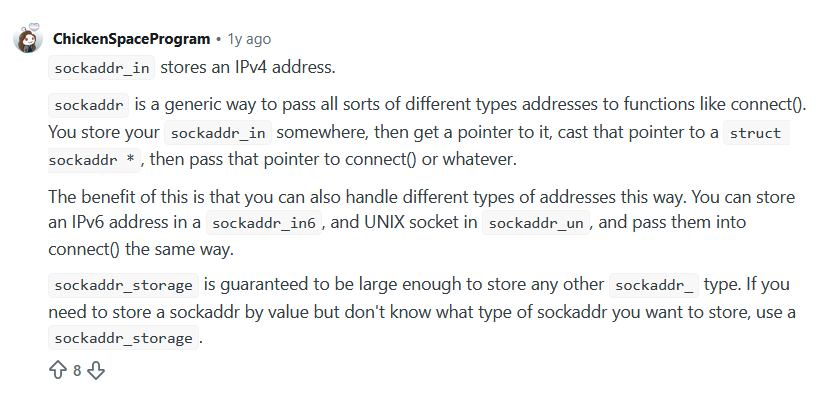
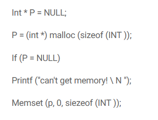

# lab 1 work

For debugging you should instead use fprintf(stderr, ...), which the autograder will ignore

**parsing commands** -- getopt_long()

**binding server to** -- 127.0.0.1

**BSD sockets API?**

need a thread per client
+ concurrently using pthreads: spawn one thread per connected client to handle that client’s messages.

remember: threads share heap but NOT stack

+ recc: implement exit first


**Set SO REUSEADDR on your listening socket before you bind(). Without it, restarting your server on the same port shortly after shutting it down fails with “Address already in use”, because the old socket is still lingering in TIME WAIT**

## BSD

[berkeley sockets](https://en.wikipedia.org/wiki/Berkeley_sockets)

app programming interfact (API for intener, unix sockets for process - to - process comms)

[api ref](https://web.mit.edu/macdev/Development/MITSupportLib/SocketsLib/Documentation/sockets.html)

`int socket (int family, int type, int protocol)` -> creates new [socket](https://man.freebsd.org/cgi/man.cgi?query=socket&manpath=FreeBSD+13.3-RELEASE+and+Ports) of a certain type (family = AF_INET (ipv4))
+  type can be **SOCK_STREAM for TCP sockets** or SOCK_DGRAM for UDP sockets
+  server
  

`int socket_connect (int sockFD, struct sockaddr *servAddr, int addrLength);` -> Connects a socket to a remote host on a given port. If this is a SOCK_STREAM (TCP) socket, socket_connect() will actually perform TCP negotation to open a connection. 
+ client

`int socket_read (int sockFD, void *buffer, UInt32 numBytes);` -> Reads data from the socket into buffer. numBytes should be the size of the buffer. socket_read() may not fill the entire buffer.

socket_read() returns the amount of data which was read. If there is an error, -1 is returned and GetMITLibError() can be called to retrieve the error code. If 0 is returned, this means that the socket received an EOF (the remote host closed the connection gracefully.) To perform a full read on a socket, continue to call socket_read() until the desired number of bytes have been accumulated. Note that socket_read() may block if no data is available to be read. This condition can be checked using socket_select().

The socket must be connected.

Note: the standard library call read() is not supported for sockets.

`int socket_write (int sockFD, void *buffer, UInt32 numBytes);` -> Writes data to the socket from buffer. numBytes should be the amount of data in the buffer. socket_write() may not write out the entire buffer.

socket_write() returns the amount of data which was written. If there is an error, -1 is returned and GetMITLibError() can be called to get the error code.

The socket must be connected.


better read/write?

int socket_recv (int sockFD, void *buffer, UInt32 numBytes, int flags);

    This function is similiar to socket_read() with the addition of a final parameter. socket_recv() reads data from the socket into buffer. numBytes should be the size of the buffer. socket_recv() may not fill the entire buffer. If flags is set to MSG_DONTWAIT, then socket_recv will not block if not data is available.

    socket_recv() returns the amount of data which was read. If there is an error, -1 is returned and GetMITLibError() can be called to get the error code. If 0 is returned, this means that the socket received an EOF (the remote host closed the connection gracefully).

    The socket must be connected.

int socket_send (int sockFD, void *buffer, UInt32 numBytes, int flags);

    Similiar to socket_write(), socket_send() writes data to the socket from buffer. numBytes should be the amount of data in the buffer. socket_send() may not write out the entire buffer. If flags is set to MSG_DONTWAIT, then socket_send() will not block waiting for buffers to become free.

    socket_send() returns the amount of data which was written. If there is an error, -1 is returned and GetMITLibError() can be called to receive the error code.

    The socket must be connected.


int socket_shutdown (int sockFD, int howTo);

    socket_shutdown() closes one or both directions of a connected socket. howTo can be SHUT_RD, SHUT_WR or SHUT_RDWR. SHUT_RD tells it to close the reading side of the connection (reads from the socket will no longer be possible). SHUT_WR tells it to close the writing half of the socket (this will cause it to send an orderly disconnect to the remote host, telling that host it no longer has anything to write). SHUT_RDWR tells it to close both halves of the connection (It is still necessary to free the socket with socket_close()).

    socket_shutdown() returns 0 on success and -1 on failure. If -1 is returned, call GetMITLibError() to get the error code.

int socket_close (int sockFD);

    socket_close() frees a socket's resources, disconnecting it from the remote host, if necessary. Both TCP and UDP sockets should be closed with this function.

    socket_close() returns 0 on success and -1 on failure. If -1 is returned, call GetMITLibError() to get the error code.

## notes

so server starts up first with

-> ./server --port 8080 --password pw123

**NOTE: must be a PERSISTENT TCP CONNECTION**
+ only close when user types :exit

we give a port number

so to start the connection:

```C
// create a socket
// AF_INET -> IPv4
// SOCK_STREAM -> a TCP connection
// PF_INET -> IPv4 protocols
int socket = socket(AF_INET, SOCK_STREAM, PF_INET);

if (socket == -1) { // error has occurred
  fprintf(stderr, "Socket creation failed!");
  exit(2);
} // end if

// use a sockaddr in for giving to bind
// this is the GENERAL LISTENING SOCKET!
// not the connecting socket for a specific client.
// TODO may need malloc here.
// https://man7.org/linux/man-pages/man3/sockaddr_in.3type.html
// https://man7.org/linux/man-pages/man3/inet_addr.3p.html
struct sockaddr_in address;
address.sin_family = AF_INET; // same IPv4 family name
address.sin_port = [PORT GIVEN ON COMMAND LINE], // legit the port number
address.sin_addr = inet_addr("127.0.0.1") // server addr, local host always
// address.sin_zero -> This field is reserved. Set this field to hexadecimal zeros.

// TODO: SO_REUSEADDR note

// bind the address, port to the socket
// socket -> the socket descriptor
// address -> the sock addr made above with all connection info
// size of the address -> need to pass
// https://man7.org/linux/man-pages/man2/bind.2.html
int bind_int = bind(
  socket, 
  (struct sockaddr *) &address, 
  sizeof(address)
  );

// then listen
// mark socket as passive -- socket will be able to accept
// incoming connection requests using accept
// https://man7.org/linux/man-pages/man2/listen.2.html
// socket -> our socket file descriptor (sockfd)
// backlog -> how many pending connections can grow in a queue
//            for this socket.
//            for right now, making 1? but play
int listen_success = listen(socket, 1);
if (listen_success == -1) { // error occurred
  fprintf(stderr, "Listening setup failed!"); 
  exit(2);
} // end if

// the above 3 steps must happen before accept can be used.

while (true) {
  // then accept once knock on door -- likely threading here.
  // return file descriptor for a NEW client socket created
  // on connection accept.
  // original socket is unaffected by this call. 
  // will pull the first from the queue for connections.
  // if socket is not marked "non-blocking", this call blocks
  // the caller, hence the while true is a "quiet wait", not busy
  // https://man7.org/linux/man-pages/man2/accept.2.html
  client_socket = accept(
    socket, 
    // not entirely sure this is correct
    // can be NULL--why?
    (struct sockaddr *) &address, 
    sizeof(address)
    );

    // TODO FROM HERE
    // check to see if space in client list (mutex)
    // if so:
    //   add to list, spin up a client thread to handle their connection
    // else:
    //   reject the connection, avoiding the overhead of a client thread

    // client thread should hold all the handling of broadcasting changes, dealing with input of client, and closing the connection once :Exit typed.

    // TODO next: just implement the connection first and ensure the socket open/close is working correctly before getting in to the threads

}


```

python BSD flow

```py
serverSocket.listen(1) # wait for a knock on the door; max number of queued connections: 1
print('The server is ready to receive')
while True:
  # when client knocks, accept makes the new
  # pipe socket to client
  connectionSocket, addr = serverSocket.accept() 

  # now through the connection socket, server can receive from that particular client.
  sentence = connectionSocket.recv(1024).decode()
  capitalizedSentence = sentence.upper()
  connectionSocket.send(capitalizedSentence.encode())
  connectionSocket.close() # non persistent?
```

[sock addr nonsense](https://www.reddit.com/r/cpp_questions/comments/1mzsne8/difference_between_sockaddr_in_and_sockaddr/)



hmmm, [memset vs malloc](https://cplusplus.com/forum/general/69810/)
+ memset sets values in the already allocated block
+ malloc does the allocation
  + so can you not use memset until malloc already used?

