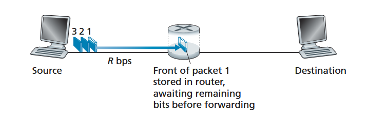
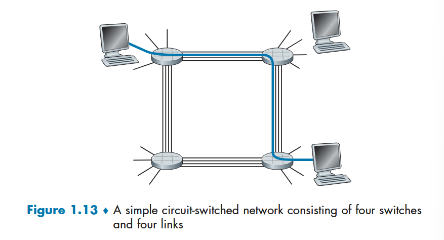
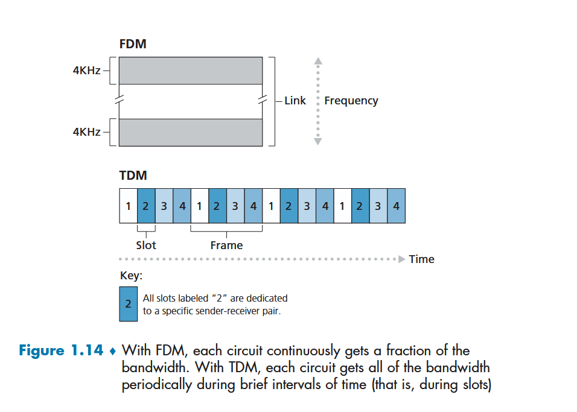
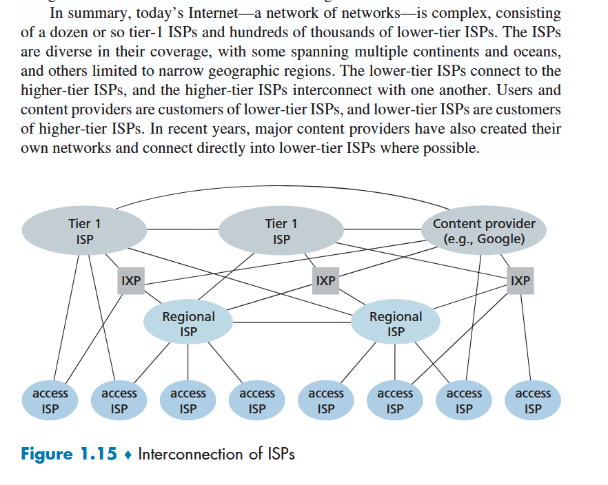
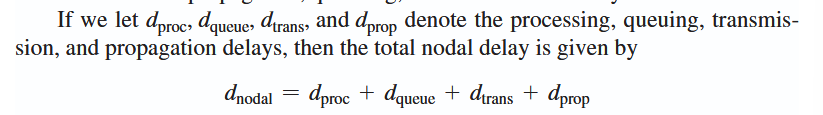
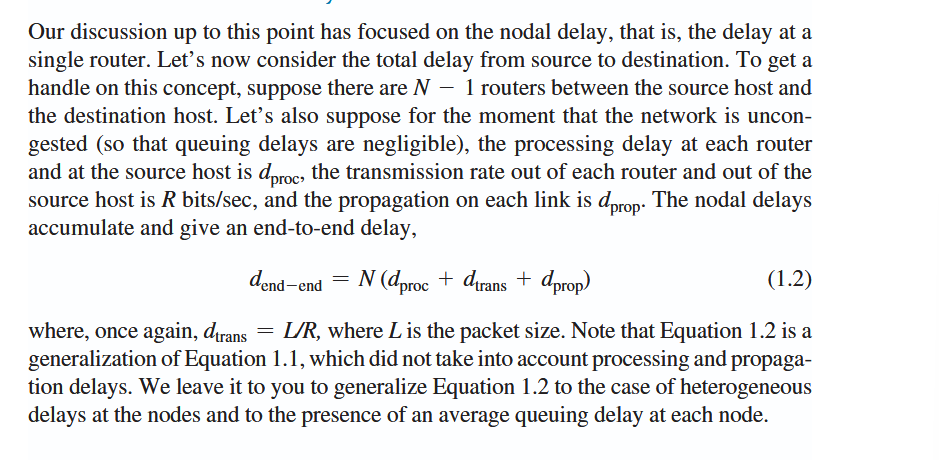

# 1.1: What is the internet (lol)

+ Internet -- computer network that connects billions of devices in world
	+ not just computers, remember mobile devices, smart home tech
+ All devices **hosts** or **end systems** -> **server/client**
+ end systems connected by **communication links** and **packet switches**
	+ comm links -> physical connections (optical fiber, copper wire, etc)
		+ diff **transmission rates** for diff links (fast/slower)
			+ measured bits/sec
	+ packets -> packed up data with headers and shit
	+ packet switch -> receives packet on incoming comm link, forwards packet on outgoing comm link
		+ ROUTER is a packet switch! also "link layer switch"
		+ like a digital truck dispatcher/warehouse stop; monitors and controls the traffic of shipments (packets) accurately and efficiently
+ end users access internet via **ISP** -> **Internet Service Providers**
	+ they provide the packet switch and sometimes comm links
	+ i believe we talking comcast, century link, etc...
		+ this is opposed to the global network providers like AT&T and shit--the shadow tier-1 network providers.
+ **protocols** used in sending/receiving information to keep things nice and consistent and trustworthy
	+ TCP AND IP! BIGGIES!
	+ **IP** -> Internet Protocol, specifies format packets are sent and received in
	+ **TCP** -> Transmission Control Protocol (not defined here)
+ "Internet standards are developed by the Internet Engineering Task Force "

+ distributed applications -> just means applications with multiple end users exchanging data back and forth, jargon
+ **socket interface** ->specifies how one programming running on a system asks the internet infrastructure to deliver data to a specific destination program 
	+ remember socket/port listening and sending -> akin to an address

+ protocols defined handshakes and standards
	+ "*A protocol defines the format and the order of messages exchanged between two or more communicating entities, as well as the actions taken on the transmission and/or receipt of a message or other event.*"
+ different protocols == different communication tasks
****
## Questions
+ Link-layer switches are typically used in access networks, while routers are typically used in the network core. -> what's network core? *i think they just use it to main the internal network structure, not devices that connect--as opposed to network edge*

# 1.2 The Network Edge

+ use wording "end system" because these typically sit at the edges of the internal internet infrastructure
	+ in book *host == end system*
	+ and host can be divided to *client and server*
		+ generally:
			+ **client** -> requesting machine
			+ **server** -> serving request machine, or receiving machine
### access networks
#### home access
+ home access: DSL, cable, FTTH, 5g fixed wireless
+ DSL -> digital subscriber line
+ DSL and cable most common home connections
+ **DSL** typically comes from local phone provider too
	+ DSL basically just transmitting data packets over phone wires haha
	+ carries both data and phone signals, but at different frequencies so that same comm link can be used at same time for the two diff things
	+ **splitter** separates data from phone signals arriving to the home by frequency and sends to appropriate place
	+ **DSLAM** separates data from phone going out 
	+ phone lines are limited by cable, electrical interference, and designed for short distance of data being sent (so not great if a long way)
+ **Cable** makes use of the cable tv company's cable just as DSL to phone cable
	+ collision of request traffic is the biggest downside here (both downloading a video makes it slower for both of us)
+ **FTTH** -> fiber to the home; optical fiber from the control office right to your house
	+ very fast
+ **5G** ->basically no cable at all, but things are transmitted wirelessly. huh
#### enterprise access (and home)

+ **Ethernet and wifi**
+ local area network == **LAN**
+ ethernet is copper wire connection to 
#### phones
+ use the same infrastructure as phone network to send/receive packets wirelessly; needs a base station offered by the cell network provider
+ 3g, 4g, 5g -- all being spent on for more SPEED

#### physical media
+ dsl, ethernet -> copper wire
+ mobile access networks -> radio waves
+ "Examples of physical media include **twisted-pair copper wire, coaxial cable, multimode fiber-optic cable, terrestrial radio spectrum, and satellite radio spectrum**"
+ **guided media** -> waves representing low/high bits go through solid medium
+ **unguided media** -> waves propagate through the atmosphere (radio signals, satellites...)
+ just neat: optical fiber pulses light? not voltage to rep bits
+ wireless signals -> pretty much radio waves (short and long form.
+ huge delay on signals from satellites; low earth orbits (LEO) may be used someday more seriously
	+ typically microwave signals.

## Questions
+ is cable faster than DSL? and why?
+ cable has its own physical deterioration issues. if 5g is wireless, wouldn't it be impacted by severe weather? how do things actually transmit wirelessly?
+ how does a wifi access point enable access? like what's the tech there, you know? *i believe radio waves primarily from further reading*
+ Is an upgrade to 4g, 5g an update in the cables used to transmit? more? how is 5g phone connection related to the 5g internet connection -- same thing?

# 1.3 The Network Core

+ at core, network is exchanging of messages
	+ data, control functions, etc
+ **packets** -> small chunks of data
+ packets transmitted at rate **(L bits) / (R bits/s)**
+ packets go through **packet switches** (routers, link layer switches)

### packet-switching / store and forward transmission
+ use this at the inputs to the links
+ **packet switch MUST receive the ENTIRE packet prior to transmitting the first bit of packet to outbound link**
	+ get it all before passing along message
+ takes L/R seconds to transmit a packet to packet switch, and another L/R to transmit packet switch to destination (simplest case): **2L/R delay on this system**
+ 
	+ note: ignoring the processing packet step on receiving
+ if n links: **n(L/R) delay** 

*TODO: how long in terms of packets*

+ each outgoing link has a queue to put packets into for sending out
	+ **output buffer**
	+ also causes a delay
+ *how does a packet switch know where to send things/which outgoing to use*
	+ done in diff ways, but in the internet:
		+ everything has IP address
		+ the sender includes the destination IP in the packet header
		+ each router has a **forwarding table**
			+ maps destination addresses/portions of them to an outbound link
			+ more detail in further section, but the internet uses **routing protocols** to automatically set forwarding tables
				+ ie, a protocol could conduct a shortest path search to destination listed in packet header

### circuit-switching
+ in these networks, **resources for communication between end systems are reserved for the lifetime of the intercommunication between them**
	+ packet-switch networks do not do this
		+ walkins only
	+ reservation only restaurant
	+ telephone network is example of this
	+ end to end connection established when 2 machines want to chat
	+ 
+ implementations
	+ **frequency band multiplexing** -> circuit link dedicates a frequency band to each connection for the duration of the connection (frequency == bandwidth)
	+ **time division multiplexing** -> circuit link assigns time slots to specific links for the connection
	+ 
+ con: dedicated circuits are *idle during quiet periods*, as dirty packet switch lovers say
	+ ie, someone stops talking on the phone but they're still on the phone.

### packet v circuit
+ packet has risk of getting backed up and wait times
+ packet often is more simple to implement
+ circuit has risk of quiet period underutilization
+ circuit usually requires some complex handshaking to establish the link, making it harder to setup/maybe not as computationally efficient
+ typically, **packet is just more efficient given probabilities of people actively using their machines over passively**.
+ 
## Questions

+ maybe having a hard time fully visualizing the TDM
+ whats a positive use case of circuit switche?s?

# 1.4 Delay, Loss, and Throughput in Packet-Switched Networks

### packet switch network delays

+ **processing** delay: router needs a moment to determine where to send the packet, processing bit level errors, etc...
+ **queuing** delay: delay from having to wait in outbound buffer
+ **transmission** delay: amount of time to push all the bits onto the outgoing link
	+ *time it takes to get a car through a toll booth*
+ **propagation** delay: how much time after being pushed onto outbound link needed to get from A to B
	+ depends on physical medium and distance
	+ *time it takes for car, once past toll booth, to travel to next toll booth*
+ diff between transmission and propagation: 
	+ transmission is a function of packet's length and transmission rate of link--nothing to do with distance between A and B
	+ prop is a function of distance between A and B, nothing to do with packet length or trans rate
+ 
+ **total delay = process_d + queue_d + trans_d + prop_d**
### queue delay/packet loss

+ L -> num bits; R -> transmission rate
+ **traffic intensity**: La/R, where La bits/sec is the average rate the bits arrive in the queue
	+ a -> packets per sec
	+ if La/R > 1, ave rate of bit arrival exceeds the rate at which they can be transmitted, and the queue will increase without bound, lol
		+ *design your system so that traffic instensity is no greater than 1*
+ if packet shows up to queue and is full, router will drop the packet
	+ packet is LOST
+ routers measured by queue delay AND packet loss

### end to end delay

+ **end2end_d = n_routers_enroute(process_d + trans_d + prop_d)**

### throughput

+ like, the instant of time at which host B is receiving a large file from host A.
	+ think download progress bar
	+ **average throughput** -> F/T, F = file size in bits, T = time in secs to receive full file
+ throughput is only as fast as its slowest link speed (**bottleneck link**)
## Questions
+ do that La/R by hand -- maybe the 1 feels plucked from no where, but i think i just need to do the math a little
	+ apparently an animation on the book website for this
+ *We leave it to you to generalize Equation 1.2 to the case of heterogeneous delays at the nodes and to the presence of an average queuing delay at each node.* ^^ end2end_d
+ pingplotter