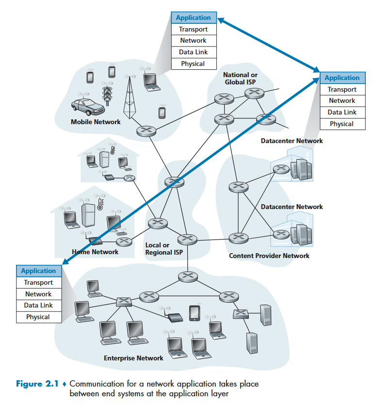
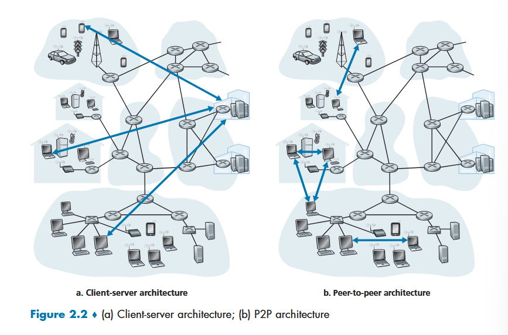
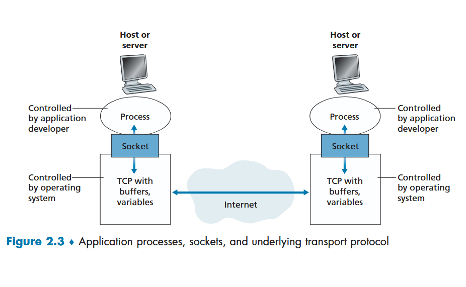
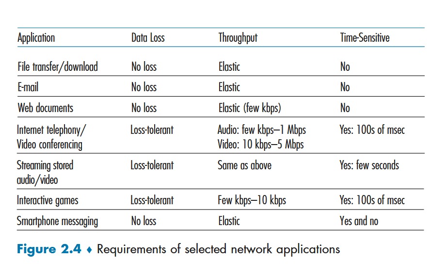
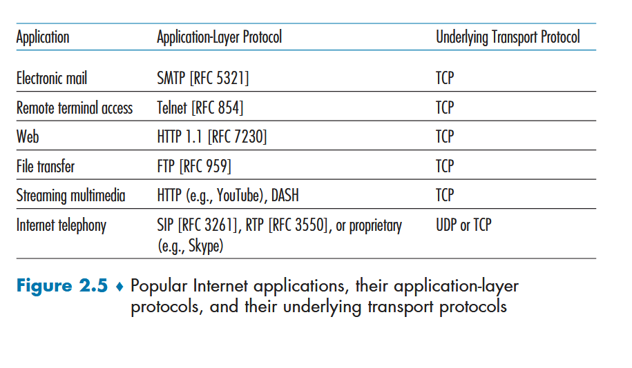
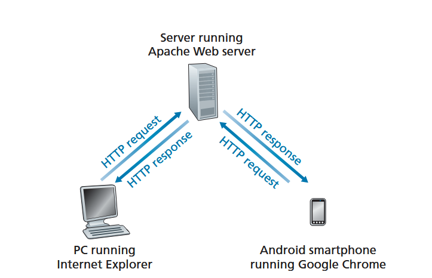
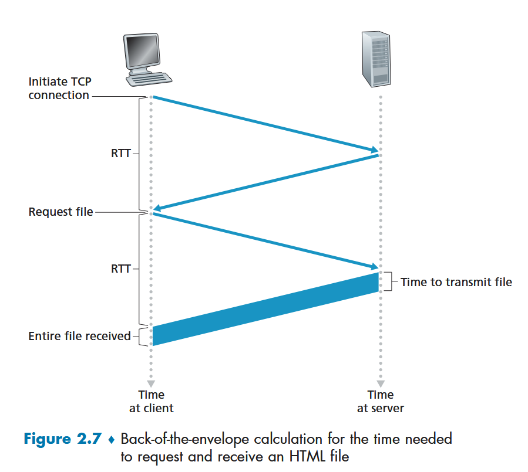

# Reading 2.1 - 2.2 Notes

pages 80 - 116

TODO: mention of socket programming exercises at end of chapter 2 

## 2.1: Principles of Network Applications

application software is designated to end-systems, so network core hardware only worries about the transmitting of information 
+ enables rapid development



### architectural designs for network apps

more than just this, but usually

1. **client-server architecture**: client always requests something from server and server returns.
   + clients never talk directly, only through server
   + **data centers** are just many many servers
2. **peer-to-peer (P2P) architecture**: not talking through a dedicated server, but two smaller machines talk directly
   + example: bittorrent -> file sharing 
   + liked for scaleability
   + dislikes for security concerns, performance, and reliability



communications between processes, whether p2p or client/server, communicate through **messages** with specific protocol

process sends messages *into and receives* messages via network through a *software interface* called a **socket**
+ process is a house, socket is a door
+ sending process assumes there's infrastructure to get its message on its way out the socket (door)
+ socket is kinda the API between the application and the network



when sending messages need
1. destination address (IP)
2. know the process to send it to (or socket to send to) -> this comes in form of **port number**
   + some ports are specific to popular applications 
     + 80 -> web server 
     + 25 -> SMTP

### transport layer protocols

need to choose one when sending a message
+ like choosing to travel over car or plane--pick one that suits your purpose

ways to analyze the different protocols
1. **reliable data transfer** (fights packet loss)
2. **throughput** (guarantee at a specific rate; elastic apps provide as much as possible at the time)
3. **timing** (general time capping on delays)
4. **security** (encryption, etc)



#### TCP

+ handshack between client and server happens before any data sent
  + after that, back and forth flows freely
+ very reliable in transfer
+ TCP has a congestion-control where it throttles a sending process (client or server) when network congested
+ side note: TLS is an enhancement for TCP that adds encryption/authenticaion to the data passed around (TCP does not natively encrypt)
```
sending data -> TLS socket --> TLS -> TCP socket --...--> TCP socket --> TLS --> TLS socket --> receiving process
```
#### UDP

+ lightweight, no frills, minimal
+ no handshaking/connection made
+ unreliable
+ things may arrive out of order




### app layer protocol

**app layer protocol** - defines how messages are passed between end systems 
  + http
  + neato, skype uses proprietary app layer protocols


http defines the format and sequences of messages exchanged between client/server

## 2.2: Web and HTTP

hypertext transfer protocol
+ defines how the messages between client and server should be passed back and forth
  + defines how client should request and how server should respond
  + **default port: 80**

*TODO: diff between tcp and an applayer protocol?*
  + wonder if: app layer protocol is more the actual data format, whereas the transport layer protocols are like...the metdata packet format
  + "http uses tcp as its underlying transport protocol"
    + so kinda built on top of transport layer?
  + "once the client sends a message into its socket interface, message is now out of hands of client and in hands of tcp"
  + tcp is the reliable data transfer service for http
  + tcp handles all the responsibility of getting the http message from point A -> B. http only needs to worry about its formatting

1. http client initiates connection with server via tcp
2. connection established
3. client sends http request messages to socket interface -> port on server side
4. server receives http req and sends http response back in same way



implemented in client and server programs

**web page** - just a document
+ consists of "**objects**" - just a file (html, ls, jpeg...)
+ if web page has an html and 2 jpgs, web page has 3 objects

**web browsers implement the client side of http**
+ chrome

**web servers implement server side http, house web objects, addressable by url**
+ apache

**http is stateless** -- no info about the client or its activity is stored by the server.

### persistent connections

**persistent connection** - request/response pair sent over same tcp connection
+ **non-persistent** - req/resp pair sent over separate tcp connections.

#### http with non-persistent

server has an html and 11 jpg on same end-system that it must serve to client

1. client makes tcp connection to server www.example.com on port 80; socket at client, socket at server 
2. client sends http request to server via socket for index.html
3. server receives the request message, retrieves the object (index.html file) from storage, packs up as an http response messahe, sends response message via socket to client
4. http server process tells tcp to close the tcp connection (and tcp will close once it hears that client has received the message in tact)
5. http client receives, tcp connection terminates.
6. we've received the html! now we have to repeat the process 1 - 5 for all 11 jpgs, lol

TLDR: different tcp connection established for every object needed.
+ can be sped up with parallel tcp connections instead of serial



**time**: 

$2*RTT + trans\_time$ **per object**

obviously not great when a huge amount of objects to gather.

#### http with persistence

+ after connection established, kept open on server after response sent
  + subsequent response/requests go through this tcp connection
  + requests made back to back without waiting for replies for pending reqs
+ typically http server closes connection after a time period (timeout interval to set by configutator)

*TODO: compare the time of this to non-pers.*
+ wouldn't it just be a single RTT?

### http message format