# Reading 2.1 - 2.2 Notes

pages 80 - 116

TODO: mention of socket programming exercises at end of chapter 2 

## 2.1: Principles of Network Applications

application software is designated to end-systems, so network core hardware only worries about the transmitting of information 
+ enables rapid development


### architectural designs for network apps

more than just this, but usually

1. **client-server architecture**: client always requests something from server and server returns.
   + clients never talk directly, only through server
   + **data centers** are just many many servers
2. **peer-to-peer (P2P) architecture**: not talking through a dedicated server, but two smaller machines talk directly
   + example: bittorrent -> file sharing 
   + liked for scaleability
   + dislikes for security concerns, performance, and reliability


communications between processes, whether p2p or client/server, communicate through **messages** with specific protocol

process sends messages *into and receives* messages via network through a *software interface* called a **socket**
+ process is a house, socket is a door
+ sending process assumes there's infrastructure to get its message on its way out the socket (door)
+ socket is kinda the API between the application and the network


when sending messages need
1. destination address (IP)
2. know the process to send it to (or socket to send to) -> this comes in form of **port number**
   + some ports are specific to popular applications 
     + 80 -> web server 
     + 25 -> SMTP

### transport layer protocols

need to choose one when sending a message
+ like choosing to travel over car or plane--pick one that suits your purpose

ways to analyze the different protocols
1. **reliable data transfer** (fights packet loss)
2. **throughput** (guarantee at a specific rate; elastic apps provide as much as possible at the time)
3. **timing** (general time capping on delays)
4. **security** (encryption, etc)


#### TCP

+ handshack between client and server happens before any data sent
  + after that, back and forth flows freely
+ very reliable in transfer
+ TCP has a congestion-control where it throttles a sending process (client or server) when network congested
+ side note: TLS is an enhancement for TCP that adds encryption/authenticaion to the data passed around (TCP does not natively encrypt)
```
sending data -> TLS socket --> TLS -> TCP socket --...--> TCP socket --> TLS --> TLS socket --> receiving process
```
#### UDP

+ lightweight, no frills, minimal
+ no handshaking/connection made
+ unreliable
+ things may arrive out of order


### app layer protocol

**app layer protocol** - defines how messages are passed between end systems 
  + http
  + neato, skype uses proprietary app layer protocols


http defines the format and sequences of messages exchanged between client/server

## 2.2: Web and HTTP

hypertext transfer protocol
+ defines how the messages between client and server should be passed back and forth
  + defines how client should request and how server should respond
  + **default port: 80**

*TODO: diff between tcp and an applayer protocol?*
  + wonder if: app layer protocol is more the actual data format, whereas the transport layer protocols are like...the metdata packet format
  + "http uses tcp as its underlying transport protocol"
    + so kinda built on top of transport layer?
  + "once the client sends a message into its socket interface, message is now out of hands of client and in hands of tcp"
  + tcp is the reliable data transfer service for http
  + tcp handles all the responsibility of getting the http message from point A -> B. http only needs to worry about its formatting

1. http client initiates connection with server via tcp
2. connection established
3. client sends http request messages to socket interface -> port on server side
4. server receives http req and sends http response back in same way


implemented in client and server programs

**web page** - just a document
+ consists of "**objects**" - just a file (html, ls, jpeg...)
+ if web page has an html and 2 jpgs, web page has 3 objects

**web browsers implement the client side of http**
+ chrome

**web servers implement server side http, house web objects, addressable by url**
+ apache

**http is stateless** -- no info about the client or its activity is stored by the server.

### persistent connections

**persistent connection** - request/response pair sent over same tcp connection
+ **non-persistent** - req/resp pair sent over separate tcp connections.

#### http with non-persistent

server has an html and 11 jpg on same end-system that it must serve to client

1. client makes tcp connection to server www.example.com on port 80; socket at client, socket at server 
2. client sends http request to server via socket for index.html
3. server receives the request message, retrieves the object (index.html file) from storage, packs up as an http response messahe, sends response message via socket to client
4. http server process tells tcp to close the tcp connection (and tcp will close once it hears that client has received the message in tact)
5. http client receives, tcp connection terminates.
6. we've received the html! now we have to repeat the process 1 - 5 for all 11 jpgs, lol

TLDR: different tcp connection established for every object needed.
+ can be sped up with parallel tcp connections instead of serial


**time**: 

$2*RTT + trans\_time$ **per object**

obviously not great when a huge amount of objects to gather.

#### http with persistence

+ after connection established, kept open on server after response sent
  + subsequent response/requests go through this tcp connection
  + requests made back to back without waiting for replies for pending reqs
+ typically http server closes connection after a time period (timeout interval to set by configutator)

*TODO: compare the time of this to non-pers.*
+ wouldn't it just be a single RTT?

### http request format

**typical request message**

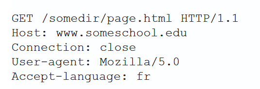

+ written in ascii text
+ 5 lines, carriage return, line feed sep
+ first line - **request line**
  + **three fields**
    1. method field
       1. **GET** - request an object (optionally include info in the url)
       2. **POST** - push information to the server (not an object)
       3. **HEAD** - similar to get, but the server responds without the requested object (typically for debugging)
       4. **PUT** - uploading objects to server (not vanilla information)
       5. **DELETE** - delete an object on the server
    2. url field
    3. http version field
+ subsequent lines - **header lines**
  + **Host** - host address the object resides at
    + *this is required by web proxy caches* even though this should be unnecessary given that the tcp connection has been established
  + **Connection** - whether to bother with persistent connections
    + close -- don't bother, non-persistence is all gucci
  + **User-agent** - browser type that is making a request to the server (firefox...)
    + useful because diff versions of a file can be sent to diff user-agents
  + **Accept-language** - literally what language version to send of an object if poss (english, french..., otherwise default version)

**general format**

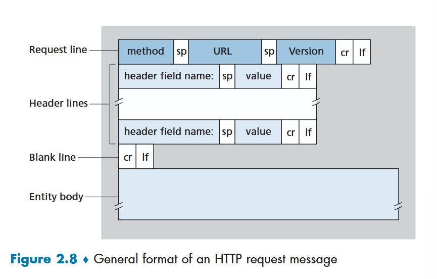

+ **entity body** - used for specific methods
  + empty with GET
  + used with POST -- for example, entity body can have the form fields on a POST method
    + note that sometimes GET is used instead and form fields are included in the url -- *security concerns?*
  
searching, get, no post
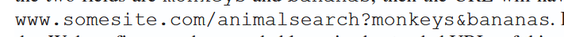

### http response message

example: 

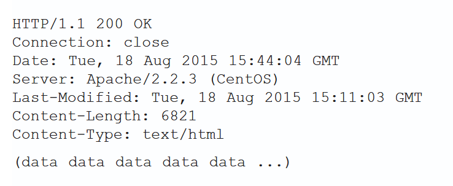

+ **3 sections:** (in order)
  + **status line**
    + 3 fields - example above; everything all good
      + **protocol version**
      + **status code**
      + **status message**
  + 6 **header lines**
    + **Connection** - same as before, tcp connection persistence
    + **Date** - time and date when http response made and sent; specifically about the RESPONSE, not any object
    + **Server** - type of server that generated response (analogous to user-agent from request)
    + **Last-Modified** - time/date *object* created/modified; critical for caching
      + network cache servers == proxy servers
    + **Content-Length** - number of bytes in sent object
    + **Content-Type** - what type the file it is; does not rely on extension
  + **entity body** - contains requested object

general format

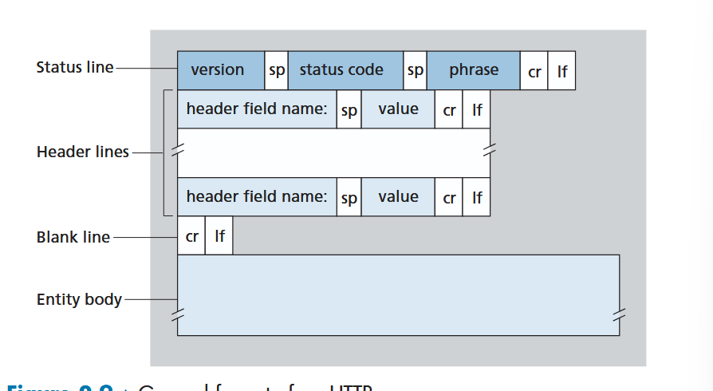

-> there are more header lines! just some of these covered for the time being since they're common

#### status codes, phrase

+ **200 OK** - request success and info returned in response
+ **301 Moved Permanently** - requested object permanently moved; new URL location returned in **Location** header; client software will auto retrieve new url
+ **400 Bad Request** - generic error code; server didn't understand
+ **404 Not Found** - requested document doesnt exist on server
+ **505 HTTP Version Not Supported** - requested http protocol version is not supported by server.

**telnet** - command to open a tcp connection to a specified port, can send a message

### user-server interaction: cookies

HTTP stateless, but there may be sometimes where you want to keep some info about the user for restrictions, serving content specific to user id...

**COOKIES** ^^^

that's how we achieve that with a stateless http

cookie tech has 4 components
1. **cookie header** line in http response message
2. **cookie header** lines in http request message
3. **cookie file** kept on user's end system and managed by user's browser
4. back-end database at the web site

working example:

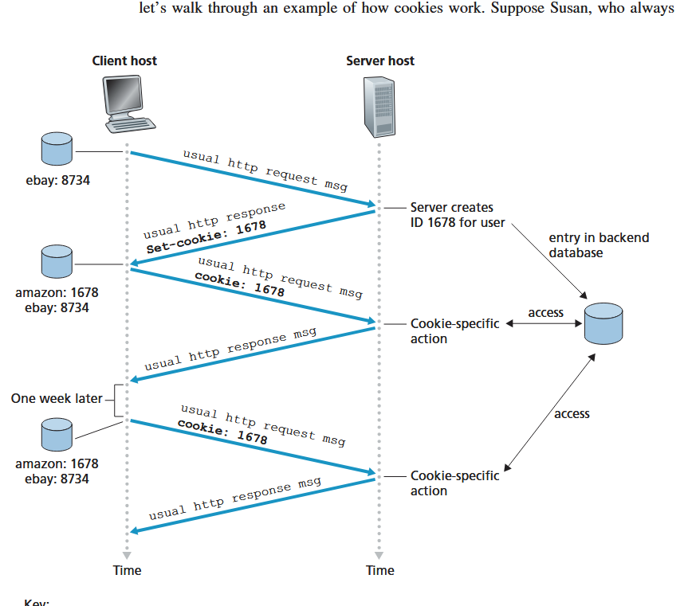

+ say susan has never been to amazon before, but uses ebay
+ when request comes into amazon server, server creates unique id number and puts it into its database (indexed by id number)
+ http response to susan's browser has a **Set-cookie** header that has the id number
  + `Set-cookie: 1234`
+ browser then appends line to its special cookie file
  + already has ebay entry
  + must add amazon
+ when susan sends through another request, http header has line **Cookie**
  + `Cookie: 1234`
+ this way amazon can track what susan does by id, can keep track of her cart, etc...
+ even a week later, browser holds that cookie, so can continue with the same information held by amazon in their database

cookies can therefore create a user session on top of a stateless http

*-> all of this info can be sold, controversy over rightful privacy concerns*

### web-caching

**web cache == proxy server**

**web cache** - satisfies http requests on behalf of the origin web server 

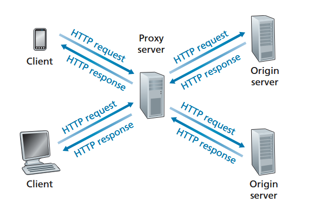

+ cache server has own disk storage
+ keeps copies of recently requested objects in storage
+ can configure browser to put through all requests to a proxy server first

example walk through
1. browser establishes tcp connection to web cache
2. sends http request for object
3. cache receives, checks to see if copy stored locally; returns if true, if not, must (1) open tcp with the origin server, (2) http request the object, (3) receive and store
4. return object to client browser via http response

typically a web cache is purchased and installed by an ISP
+ a university might install one for the campus
+ comcast my install some and configure shipped browsers to point there

#### reasoning

+ decreased response time (**speed**)
  + bandwidth between client and cache server could be better than between origin and client
+ reducing traffic to internet access link can help keep that bandwidth low, reducing **cost** for internet for an institution
  + 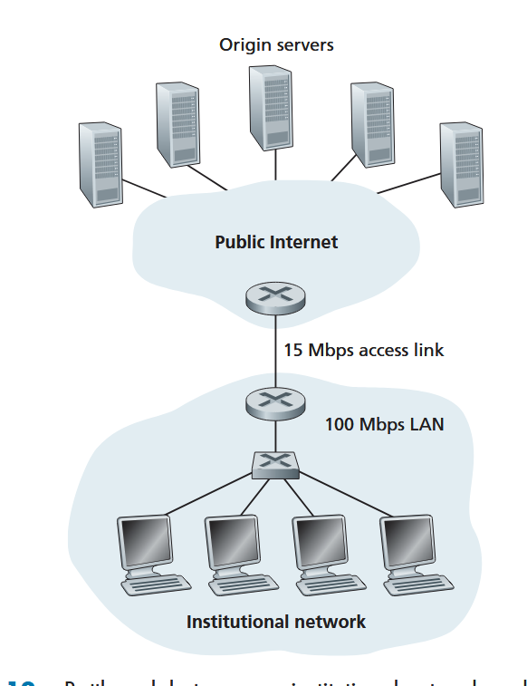
  + traffic intensity of this set up would be horribly on the access line from an instituation LAN to a router for global internet connection; to reduce, you'd have to upgrade the speed of the access link considerable, which is a costly mess
  + instead try:
  + 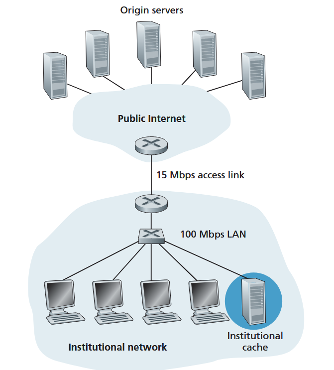
  + hit rates in a cache are 0.2 - 0.7 in practice, so this would gratly reduce the traffic on the access link, dropping the traffic intensity on access link by 20 - 70%
    + **traffic intensity less than 0.8 corresponds to a small delay in responses**

if 0.4 hit rate on cache, and about a 2 second general internet delay, average delay is about 1.2 seconds with cache:

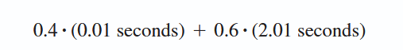

*CDN's especially rely on cache servers!! -- think about the netflix load*

#### verifying up to date objects

**conditional GET** - http request message, contains
+ GET method
+ **If-Modified-Since** header line

idea is
+ cache stores the last modified date when getting response from http server along with object
+ when another client requests object, cache server will send a conditional get request to origin, and *If-Modified-Since* is the exact entry it stored from the *last-Modfied* field earlier
  + send the object ONLY if it's been modified since
  + can receive response **304 Not Modified** if not modified
  + 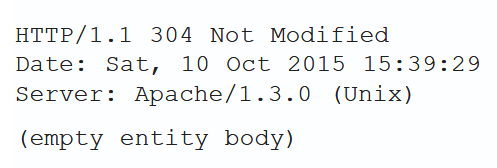

*TODO: when does the cache server send it? it can't be every request because that would defeat purpose. maybe a configured time frame? hm. because cache server initiates as a client, server probably doesn't update it automatically on modification?*

### http/2

goal: faster and more efficient data compression; 

problem: single TCP connection for all objects in a persistent connection causes **head of line blocking**
  + assume big ass file at top of page, with lots of little ones below.
    + this will take a long time to send through a single tcp connection (head of the line is blocking the little guys)
  + http/1.1 typically avoids this with parallel tcp connections
  + a goal of http/2 is to reduce number of parallel tcp connections, reducing num sockets that need to be open and maintained at servers and improving tcp congestion

problem: **framing**
+ send through set size frames of each object interleaved with rest instead of whole object
  + decreases user-perceived delay
+ http/2 can do this, and then reassemble them on the other side
+ neat, the frames are binary encoded -- *TODO: what does this mean specifically? just not ascii? one hot per num frames?*

feature: **message prioritization**
+ enable application optimization

feature: **send multiple responses for a single client request**
+ server can push multiple objects to the client without a request for each
  + helps eliminate latency for obv reasons

**QUIC** - transport layer built on UDP that's apparently quite fast
  + first deployed in 2012 --google
  + **multiplexed connections** - multiple digital/analog signals combined into 1 to reduce the back and forth/traffic
  + idea is to compete with tcp
  + quick udp internet connections
  + works hand in hand with http/3