# Reading 2.3 - 2.5 Notes

## electronic mail

**3 major components **
1. **user agent** - sender of a message (email)
2. **mail server** - receives the message and puts in an outgoing message queue; when recipient ready to read, receiving user agent retreives message from mail server
   + each recipient has a mailbox on a mail server; manages mail sent to this recipient
3. simple mail transfer protocol: **SMTP** -- uses TCP to transfer; application layer protocol for sending mail
   + client side on sender mail server
   + server side on recipient mail server 

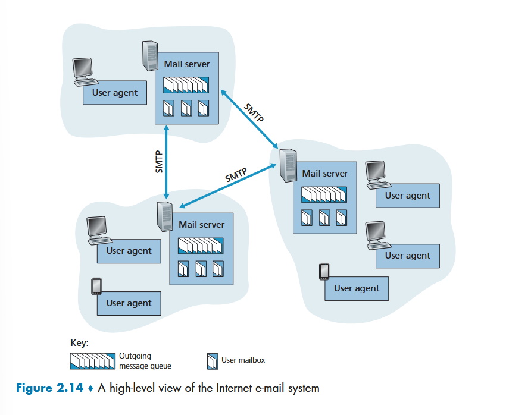

if sending fails, message will sit in sender queue and retry avery t minutes until it gives up and notifies the sender
+ its the sender responsibility to deal with a sending error (not the recipient)

### SMTP (more)

much older than http -- just neat -- 1982

wow -- body is restricted to 7bit ascii characters; things must be encoded to that.
+ legacy 1982 shit

sending simple ascii message

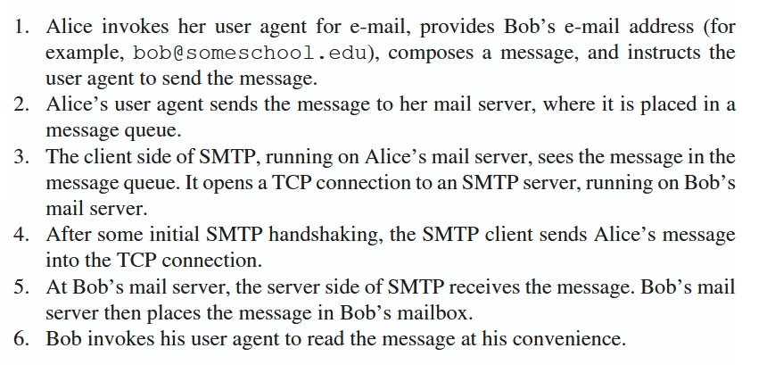

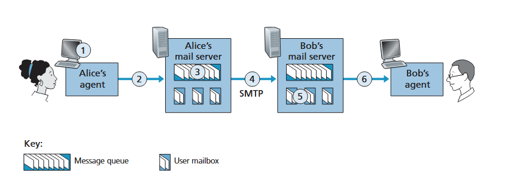

smtp server and client handshake first, THEN send the data over

~~TODO~~: what is the message sent as from alice -> the mail server? implication is that it's not SMTP from the pic, but idk
+ something later mentions that you can just make this connection from local host to a mail server no prob, so my guess is it's still smtp there.
+ answer:
  + 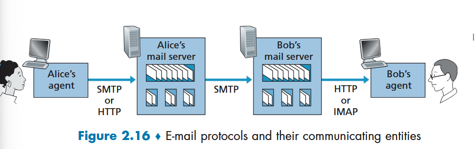

+ sender uses either smtp or http to deliver the email to their mail server.
+ recipient uses http or IMAP to pull new messages from their mail server
  + can't use smtp -- smtp is a push operation, not pull
  + internet mail access protocol: **IMAP** -- enables managing mailbox shit on the server
    + refresh: **POP** was for pulling things down to your machine, effectively deleting from the mail server, only one copy; IMAP is a reflection ofthe server and you can remove, read, etc, but everything still lives on the server.

*why a 2 step process? why alice doesn't send directely to bob's server?*
+ takes any resending due to bob's server error out of the problem space of alice's server agent machine 
  + once sent to her server, nothing is her machine's problem.

smtp after the TCP connection established:

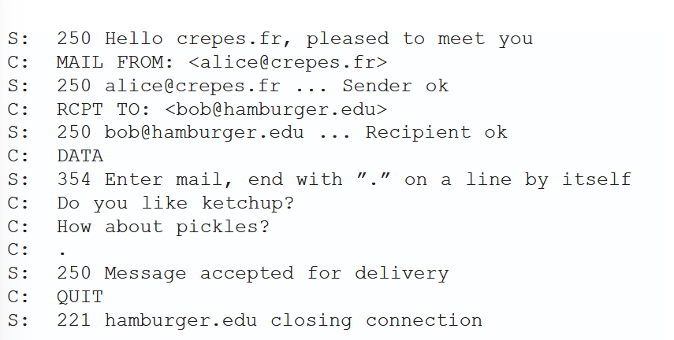

real commands: 
+ HELO (legit, hello)
+ MAIL FROM
+ RCPT TO
+ DATA
+ QUIT

(self explanatory, see above ^^)

**smtp uses a persistent tcp connection**

message itself has header lines (THESE ARE SEPARATE FROM THE SMTP COMMANDS)
+ From
+ To
+ Subject

## DNS

**hostnames** -- readable machine addresses (www.facebook.com)

**IP address** -- nice numeric name for an address; much nicer for routers to digest than hostnames
  + numbers 0 - 255 separated by a '.'

**DNS** -- domain name server

it is 2 things:
1. a distributed database implemented in a hierarchy of dns servers
2. app-layer protocol that allows hosts to query the distributed database

fun facts:
+ typically unix machines running berkely internet name domain software (*BIND*)
+ dns protocol runs over *UDP* and uses *port 53*

### DNS services

process when typing in a hostname:

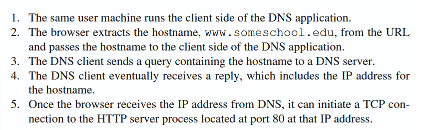

its a conversion from readable to machine readable

typically dns chat delay is small bc typically the hostname is in a nearby server

other services:
+ **host aliasing** -- multiple hostnames need to resolve to same ip: www.facebook.com; www.meta.com
  + **canonical hostname** -- the primary hostname (with underling aliases)
+ **mail server aliasing** -- if bob@yahoo.com, the mail server is likely some nightmare like relay1.xxx.something.yahoo.com -> we want to alias yahoo.com to that as a mail server alias
  + *shivers* mx records
+ **load distribution** -- if cnn.com has multiple ip's that can serve the content, the dns server can cycle through them to distrubute high traffic load better.

### overview of how dns works as hostname-to-ip service

single dns server == bad idea, huge fail point of the entire internet

DNS uses a large number of servers organized in hierarchy around the world.

3 classes of servers (high -> low):
1. **root servers**
   + more than 1000 root servers across world
   + copies of 13 diff root servers
   + managed by 12 orgs and coordinated through internet assigned numbers authority (*IANA*)
   + provice addresses of TLD servers
2. **top-level domain (TLD) servers**
   + server cluster for all the hostname extensions: com, edu, en, fr, ...
   + serve authoritative ip addresses
3. **authoritative servers**
   + hold dns records that map hostname -> IP
   + can implement your own auth server or pay to have a service provider deal with it

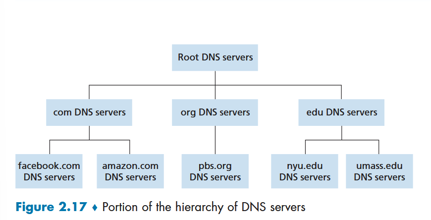

just interesting:

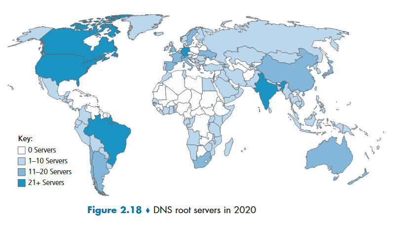

general communication flow (www.amazon.com):
1. first contact one of the root servers -- get back IP addresses for TLD servers (com)
2. client contacts a single TLD server, getting IP address for authoritative server for amazon.com
3. contact one of the authoritative servers for amazon.com, and get back IP address for www.amazon.com.

**third server: local dns server** -- ISP has a local dns server; acts as a proxy between requester and dns hierarchy; typically close to the person using network
+ speed benefit?
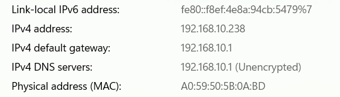

interactions: 

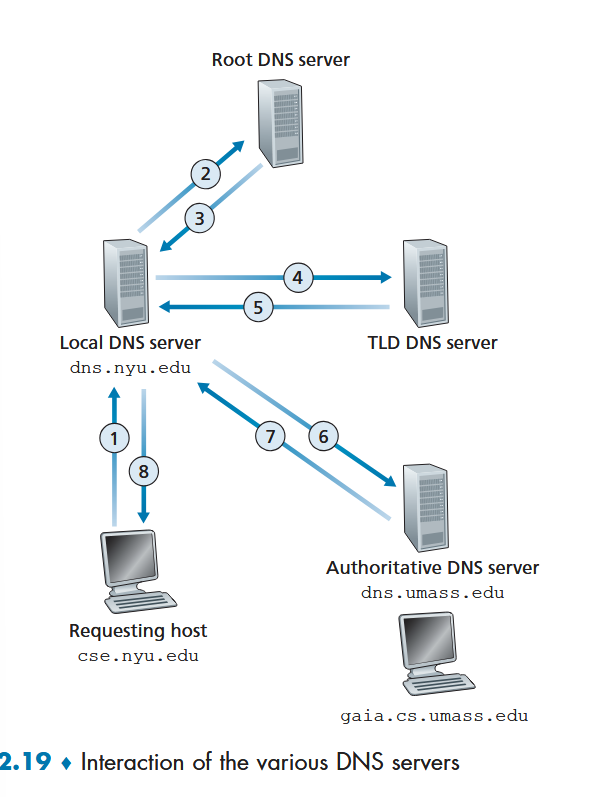

--> caching happens to ease up this 8-query interaction!
+ sometimes there's also an intermediary server between TLD and authoritative
  + allows for more specificty for like: 
    + dns.unm.edu
      + cs.unm.edu -> cs has own auth
      + en.unm.edu -> en has its own auth
    + and dns.unm.edu knows all of them
    + TLD talks to dns. auth only
  + more flexible and organized, but can add an additional 2 queries (now 10 or more)

#### dns caching

simple:

when DNS server receives DNS reply, store the response IP in local memory
+ can return this IP regardless of what kind of dns server it is (a TLD can return an authoritative IP, no prob)
+ local servers can also cache addresses of DNS servers, thereby bypassing the root in the query chain as a speed up

### dns records/messages

#### records

DNS servers have **resource records**-- typically host to ip mappings, different things that are handdyyy
+ mx record is example

resource record is a 4-tuple:

`(Name, Value, Type, TTL)`

+ **Type=A** -> Name - hostname, Value - IP address
  + ww.bar.yahoo.com -> 123.12.123.12
+ **Type=NS** -> Name -> domain, Value - name of auth DNS server that knows how to obtain IP addresses for hosts in the domain
  + yahoo.com, dns.yahoo.com, NS
+ **Type=CNAME** -> Value - canonical hostname for the alias hostname, Name - alias
  + yahoo.com, something.yahoo.com, CNAME
+ **Type=MX** -> Value - canonical name fof mail server, Name - hostname of mail server
  + foo.com, mail.bar.foo.com, MX

if dns server is authoritative -> has the A record
if dns server is not auth -> has the NS record

Alice -> local dns -> root (if not cached in tld) -> tld, get ns record -> auth, get A record
+ Alice -> TCP with returned IP -> send HTTP request 

#### messages

+ first 12 bytes is headers section
  + sent in query, copied into reply to be able to match query/response
    + there's a bit in the headers that is 0 -> isQuery, 1 -> isReply
  + buncha other stuff
+ question field contains specific info about the question being sent
  + name we want, type of question (ie, Type of record)
  + varies in length, depends on what was asked for
  + seen below, dns server fills out the answer portions

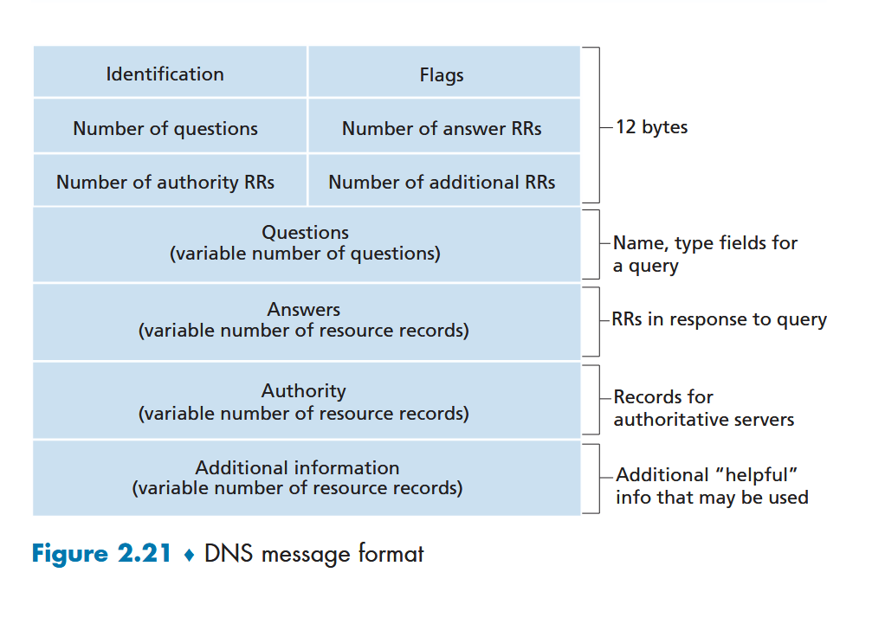

### registration

**registrar** -- organization that verifies uniqueness of a domain name, enters name into database, takes ya money
+ used to be that only Network Solutions had a monopoly on this in 1999, ha

updates used to happen statically by editing a file in the DNS server
+ now an UPDATE action has been added to the DNS protocol to allow for more dynamic add/remove/etc

## Peer to Peer file distribution

pairs of intermittently on hosts sending things back and forth (send a file to a friend...)
+ when one person distributing large file to many people, can put a huge burden on a server elsewhere, and instead can just transmit via peers, avoiding a bandwidth clog on the internet network.

**bittorrent** - has its own protocol to enable p2p

the scaleability of a client server architecture is linear accoriding to people downloading (peers)

the scaleability of a P2P is logarithmic in terms of num peers

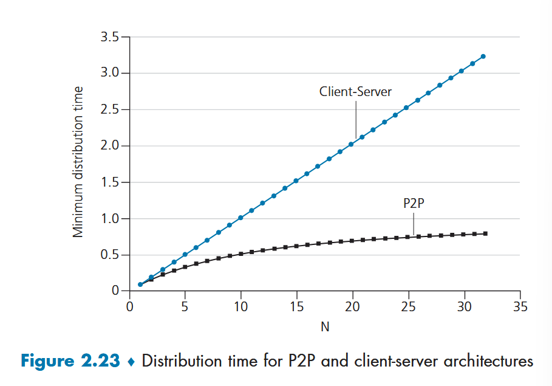

just kinda neat:
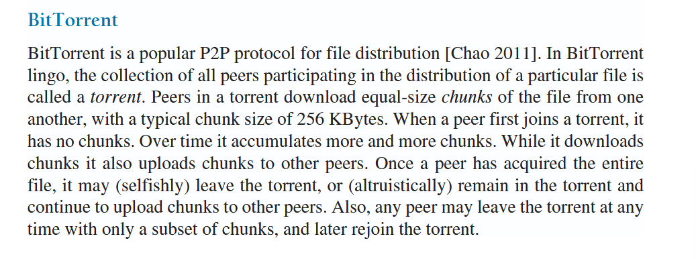
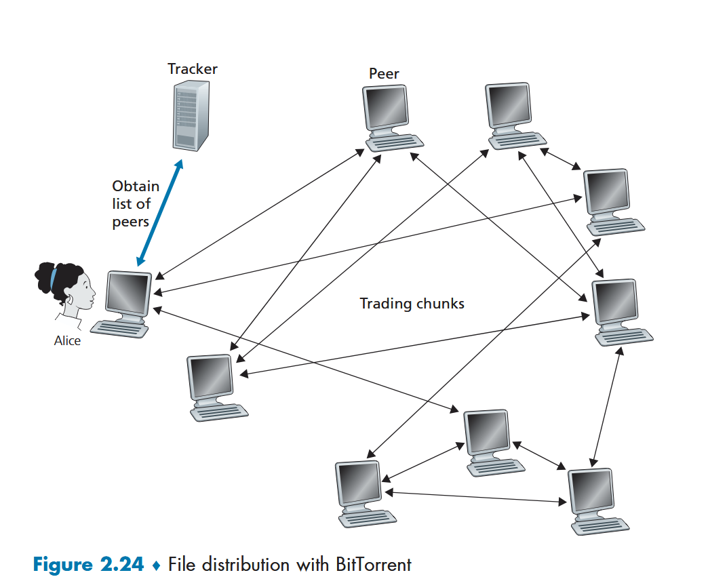

TODO: just look into bittorrent for fun