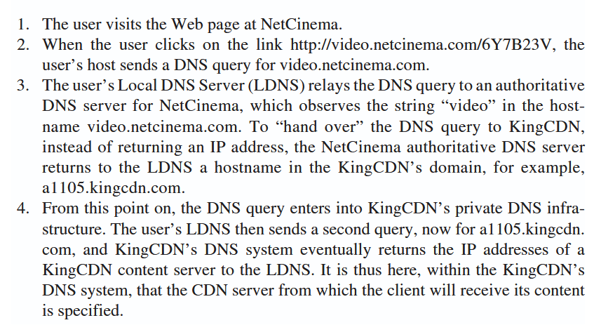
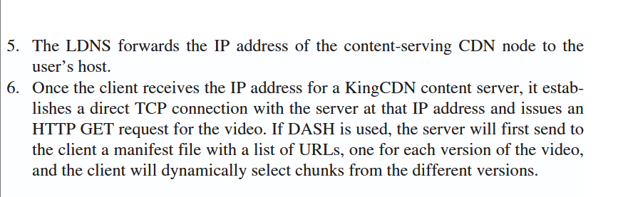
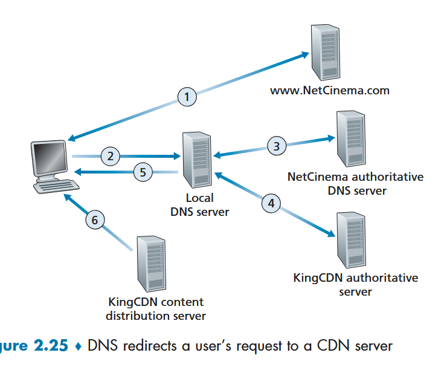
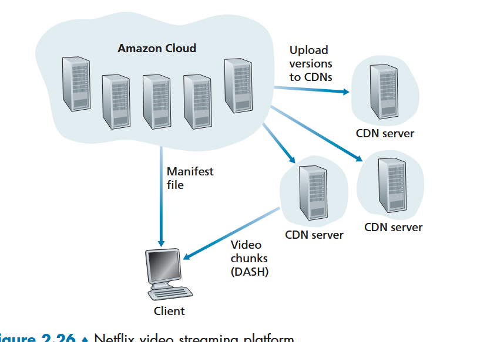
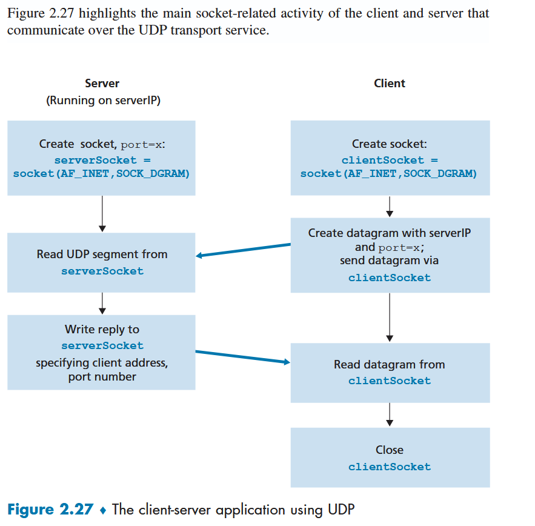
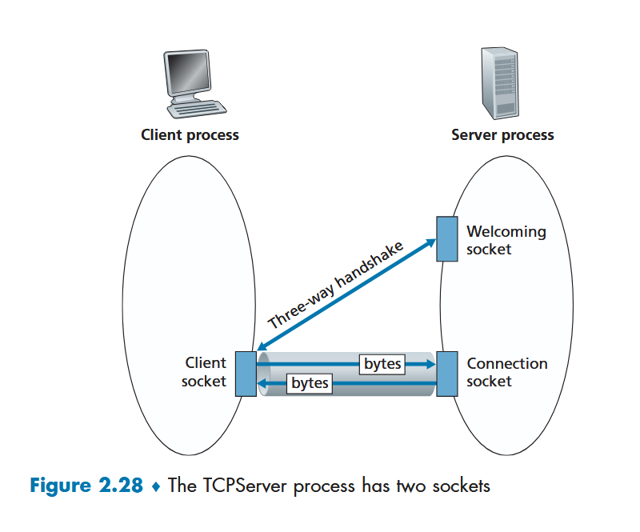
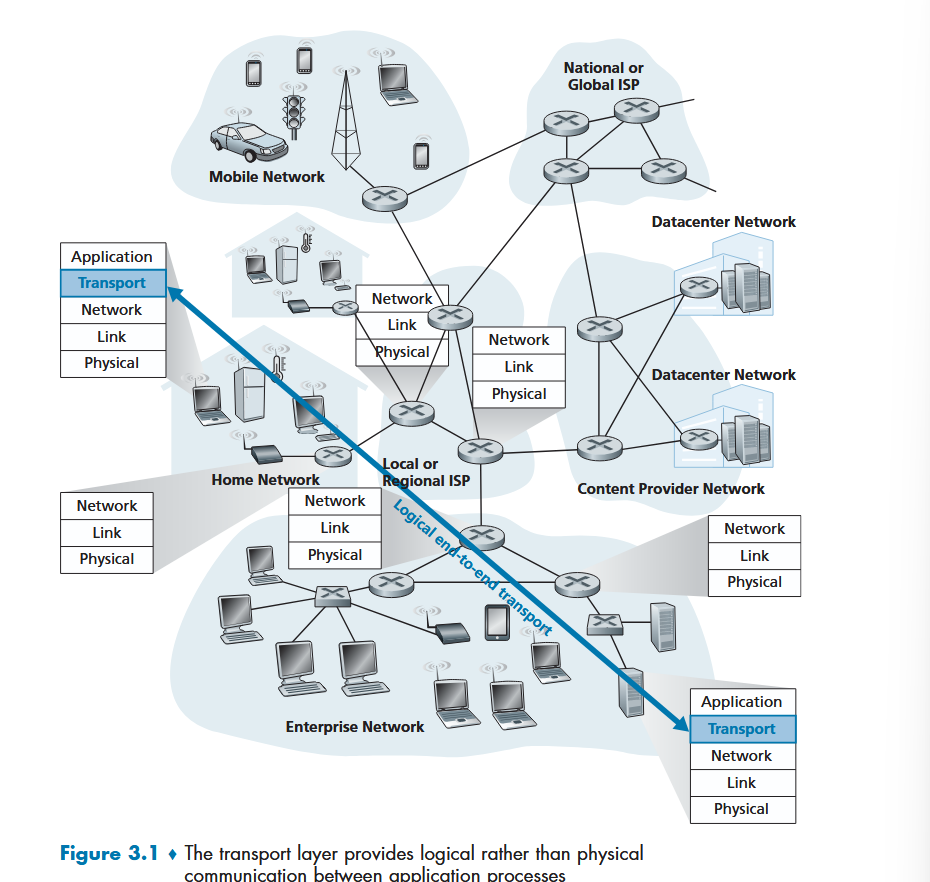
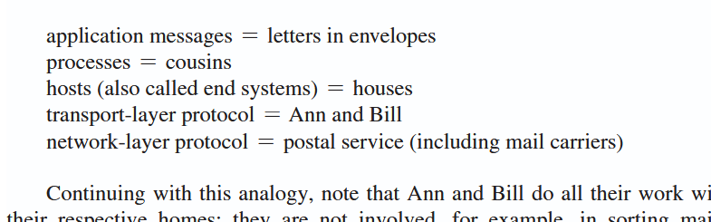

# Reading 2.7, 3.1 Notes

note: reading 2.7 because have the 8th edition of the book.

but also: may need to reference 2.6 because there is a questions about CDN performance on the hw.

## 2.6 - CDN aux notes

man, **80%** of traffic is streaming video these days, yeesh.

*with this question in mind*

```
Besides network-related considerations such as delay, loss, and bandwidth performance, there are other important factors that go into designing a **CDN server selection strategy.** **Identify at least two of these factors and explain them** (at least 5 sentences total).
```

**(at least) 2 FACTORS that go into SERVER SELECTION STRATEGY**

**cluster selection strategies**

unsure if that's what the above means, but notes from book:

+ after knowing a clients IP, CDN needs to choose a good cluster based on that ip

1. assign cluster that's geographically closest (IPs are mapped -> locations); reliant on the local dns location though, and that could be faulty
2. can also try sending probes from CDN so that it can measure real time delay; not all local dns can respond to this though.

question: what are the server strategies?

question: what are the considerations that fuel the selection?

video has high bit rates compared to other things! massive traffiv issue

### http streaming

same video available at a url for all to http get.

#### DASH

**DASH** -- dynamic adaptive streaming over HTTP

+ encode the video in several diff versions
+ each version has different bit rate (therefore different quality level)
+ client dynamically requests chunks of vid at a time (few seconds in length)
+ when bandwidth low, select from low rate version, and same with high/high
+ all goes through GET requests

the server has a **manifest file** which has a URL for each version along with bit rate

client requests manifest FIRST, then, determining bit rate with each request, requests a specific version URL depending on most recent bandwidth calculation

### CDNs

having a single server for all requesting content traffic -- *problematic*
+ if client is far from data center -- if a single bottle neck on this long ass path, mega delay for client
  + chances of this increases with number of links/hops to the data center
+ repeat traffic -- don't want to waste bandwidth on three people watching the same thing.
+ single fail point -- if data center goes down, EVERYTHING goes down.

**solution: CDN** 
+ have multiple servers globally, each has copies of the videos, etc
+ redirect people to where it's probably going to serve them best

EX: google's CDN distributes youtube vids

**third party CDNs**: distribute on behalf of companies (akamai, limelight, level-3)

#### server placement philosophies

**enter deep** -- "enter deep" into the access networks of ISPs
+ deploy server clusters in access ISPs all over the world (in the 1000s)
  + reduces the distance to most users and number of hops
  + can be a mega pain to maintain

**bring home** -- "bring the ISPs home" 
+ build larger server clusters at a smaller number of sites (in the 10s)
  + typically place their clusters in IXPs actually
  + can be slightly slighter for end users
  + less maintenance cost.

then store copies in the clusters
+ typically only store upon request from client
+ and then clear out if it hasnt been requested for a while and storage is running down

client asks for content via url, CDN must
1. intercept the request -- typically achieved through DNS
2. determine a suitable server cluster for that client at that time
3. redirect the clients request to that cluster

EX





#### netflix model


+ netflix has own private cdn
  + have server racks in IXPs and residential ISPS as well
+ push caching during slow hours
+ netflix software on amazon servers directly tells client to use a specific cdn server (no dns level redirect)
+ uses DASH

#### youtube model

+ google also has private cdn
+ many clusters in IXP, ISP
+ pull caching
+ cluster selection strategy is based on lowest RTT between client and cluster
+ DNS redirects used
+ youtube doesnt use DASH, instead forces you to pick

## 2.7 - socket programming, creating network applications

REFRESH: socket is a software API for sending items out/receiving from network.
+ analog to digital?

as long as devs write client/server programs according to the strict guideline outlined in the RFC, doesn't really matter what the apps do, but they can intercommunicate.
+ [RFC](https://en.wikipedia.org/wiki/Request_for_Comments) -- publication primarily promoted/used by IETF to set standards and technicaly processes. proposals subbed, peer reviewed...

can be 
+ open standard published in the RFC
+ proprietary standard that cannot be used by any who are outside of the business; typically connected to a sneaky, unused port.

when a socket is created, it is given an identifier -> port number
+ when sending over transmission protocol (TCP/UDP), attach the server machine ip & port num; we also attach the sender ip & port
  + done uatomatically by OS typically

**basic UDP socket flow**



### working example -- udp

12000 for the server port number.

#### UDPClient.py

```py
from socket import * # socket mod from python
serverName = 'hostname' # hostname or ip
serverPort = 12000 # server port number (process addr)

# AF_INET -> underlying network is IPv4
# SOCK_DGRAM -> is a UDP socket
clientSocket = socket(AF_INET, SOCK_DGRAM)

# note that we are not specifying the client
# port, we let OS do this for us (attach it to sending msg)
# but, we have now made the client's "door"

message = input('Input lowercase sentence:') # message to send

# message.encode() -> str to bytes
# attach the serverName, serverPort to 
# the message and send through the 
# client socket (door)
clientSocket.sendto(message.encode(), (serverName, serverPort))

# with UDP that's it, send through and hope for best

# wait for a response from server
# modifiedMessage -> the response from server
# serverAddress -> self-explanatory
# 2048 -> buffer size for input
modifiedMessage, serverAddress = clientSocket.recvfrom(2048)
# print received bytes -> str
print(modifiedMessage.decode())

# close the socket and terminate this client process.
clientSocket.close()
```

#### UDPServer.py

```py
# pretty similar to the udp client.
from socket import *
serverPort = 12000
serverSocket = socket(AF_INET, SOCK_DGRAM)

# different!
# this assigns/binds port number 12000 
# to the server's socket.
# we are explicitely assigning a port number to the socket.
serverSocket.bind(('', serverPort))
print("The server is ready to receive")
while True: # keep server process alive
  # wait for a packet to arrive
  # message -> message from client
  # clientAddress -> self-explanatory 
  #   -> has both client ip and port
  #   -> we DO need this info here to repond 
  message, clientAddress = serverSocket.recvfrom(2048)
  # simple silly server that responds with 
  # original message in uppercase.
  modifiedMessage = message.decode().upper()

  # send the response in bytes to client addr
  serverSocket.sendto(modifiedMessage.encode(),
  clientAddress)
```

### working example -- tcp

slightly more complicated because tcp is connection oriented, not just send and pray.

we drop data into a tcp connection wormhole, and we don't need to attach a destination addr -- the wormhole knows where the packet should go.

reqs
1. server MUST be running the tcp server prog to receive anything
2. server prog needs a special door for that initial handshake communication.

TCP is a **three way handshake**
1. client process "knocks" on the door of the welcoming server process
2. server hears knock, creates *a new door*, or dedicates a new socket to a specific client



NOTE: the two sockets are not the same! **welcoming socket != socket for client**

the tcp connection makes a "pipe" directly between client and server; each byte sent will be received and in order sent because of this pipe.
+ the TCP guarantee ;)

#### TCPClient.py

```py
from socket import *
serverName = 'servername'
serverPort = 12000

# SOCK_STREAM -> signifies a TCP connection rather than UDP
clientSocket = socket(AF_INET, SOCK_STREAM)
# different from UDP!
# connect first BEFORE sending.
# must do if SOCK_STREAM!
clientSocket.connect((serverName,serverPort))
sentence = input('Input lowercase sentence:')
# note send instead of sendTo
# we don't provide an address because we are sending
# through our little pipe (TCP connection)
clientSocket.send(sentence.encode())
# recv instead fo recvfrom
# we don't get a server address back on this
modifiedSentence = clientSocket.recv(1024)
print('From Server: ', modifiedSentence.decode())
clientSocket.close()
```

#### TCPServer.py

```py
from socket import *
serverPort = 12000
# again, SOCK_STREAM
serverSocket = socket(AF_INET,SOCK_STREAM)
# serverSocket is our WELCOMING socket for
# the 3 way handshake!
serverSocket.bind(('',serverPort))
serverSocket.listen(1) # wait for a knock on the door; max number of queued connections: 1
print('The server is ready to receive')
while True:
  # when client knocks, accept makes the new
  # pipe socket to client
  connectionSocket, addr = serverSocket.accept() 

  # now through the connection socket, server can receive from that particular client.
  sentence = connectionSocket.recv(1024).decode()
  capitalizedSentence = sentence.upper()
  connectionSocket.send(capitalizedSentence.encode())
  connectionSocket.close() # non persistent?
```

## 3.1 - intro, transport-layer services

this chapter is focusing on the actual transport protocols pretty specifically -- with special attn to TCP, UDP (internet protocols)

transport-layer protocol provides for **logical communication** between applications on diff machines
+ meaning: from app perspective, feels like the processes are directly connected

**transport layer protocols are implemented in the END SYSTEMS, not in network routers**

sending side:

transport layer breaks application layer data to send into transport layer **segments** (packets)
+ can break into smaller chunks if needed, each gets a header

**subtle distinction:**

-> transport layer provides logical communication between **PROCESSES** on diff hosts

-> network layer provides logical communication between **HOSTS**



quick analogy
+ cousins in houses write each other on each coast
+ postal service delivers the mail
+ ann and bill collection from postal service and distribute to the cousins

**postal service -> network layer protocol**

**ann and bill -> transport layer protocol**



note that ann and bill (transport) have no knowledge or control over the postal service (network)

*terminology note*: book will refer to TCP/UDP packets as **segments** and network protocol packets as **datagrams**
+ note though that UDP packets are also called *datagrams* in reality.

**network protocol for the internet** -- **IP!!!!!**
+ is a *best effort* delivery service
  + makes best effort to get packets delivered, but makes no guarantee -- **unreliable**

**transport layer multiplexing/demultiplexing** transport layer protocols extend host-to-host network protocols to process-to-process
+ UDP only offers multiplexing and error checking
+ TCP offers further 
  + **reliable data transfer** -- accomplishes with flow control, sequence numbers, ACK, and timers
    + things arrive correctly and in order
  + **congestion control** -- prevention of allowing one TCP connection from swamping links and routers between hosts with high traffic; regulate the rate at which sending sides send through packets
    + note that udp has no restriction on this
    + this is more of an internet wide service rather than an application-only perk