# Reading 3.2 - 3.4 Notes

## multiplexing, demultiplexing

"extending host to host network layer to process to process transport layer"

delivering data does not go directly to process, but to the socket intermediary
+ processes can have multiple sockets

**receiving, demultiplexing** -- transport layer examines headers to id the receiving socket and directs the segment to that socket
+ looking at what letters are addressed to who and handing them out 

**sending, multiplexing** -- bundling up data and header information to pass on to the network layer
+ collecting letters and handing them to the mail person

### port numbers

unique id for a socket

port numbers are a **16 bit** number (0 - 65535)
+ 0 - 1023 are **well known**
  + typically for well known protocols like http, restricted
+ well knowns outlined in RFC 1700, updated at IANA

UDP basically examines the destination port number in segment and directs segment to corresponding socket
-> TCP is more subtle

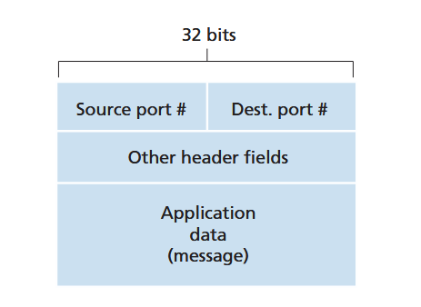


### connectionless (UDP) multi/demulti

you can get an automatic port assigned by OS or bind a specific one (1024 - 65535)
  + python `.bind("", 12345)`

```
process -> 12345 -> UDP multi ----net----> UDP demulti -> 23456 -> process
```

### connectionful (TCP) multi/demulti

UDP is defined by (destination IP, dest port)
+ don't technically need any source info

TCP is defined by (dest IP, dest port, source IP, source port)
+ all 4 values are used to demulti to the correct socket

**weird subtelty**
+ UDP, when it demultis, if two segments sent have same dest IP, port, it'll demulti *to the same socket*; if the source IP, port is different, it makes no difference.
+ TCP, on the other hand, uses all 4 values to direct to the correct socket, so if same dests and different sources, these two segments will go to *2 different sockets*.
  + this is the real evidence for two different clients having a "tunnel" to the server.

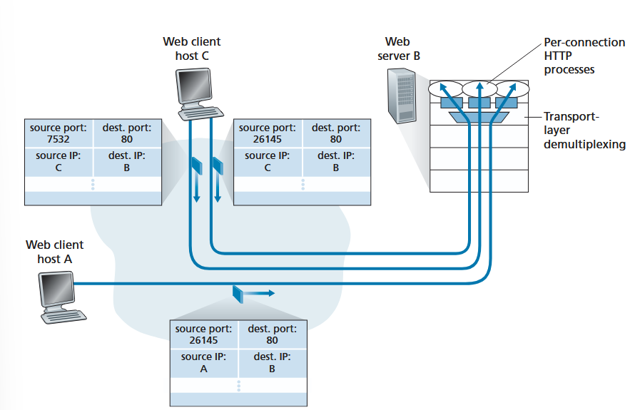

**NOTE:** not typically a 1-to-1 correspondence between client connection and process (the http processes seen above)
+ typically today: a new server thread and connection socket is spawned for each new client that is attached to a single http process

**nmap** -- a port scanner that can see what applications are attached to which ports
+ can be handy if you want to see if a security vulnerable application is running so you can attack ;)

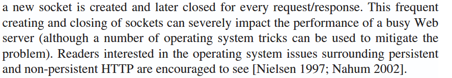


## UDP in depth

at the very least, there must be a transport service multi/demulti offered to even know where tf data needs to go on a machine

*defined in RFC 768*

UDP does 
+ multi/demulti
+ light error checking (checksum)
+ adds nothing to IP (app is almost directly talking with IP when using UDP)

DNS uses UDP (haha)
+ can always re-try a request if something seems to fail (no reply received).

**reasons UDP is used**
+ **finer app control over what data sent and when**
  + TCP has congestion control which could throttle traffic
  + TCP resends segments until receipt has been ack by dest -- sometimes real-time apps have a maximum sending rate
+ **no connection establishment**
  + no connection *delay*
  + dns likely uses this for this reason -- to avoid the introduced delay
+ **no connection state**
  + no tracking of parameters for each connection, so more active clients can typically be supported
+ **small packet header overhead**
  + TCP header -> 20 bytes, UDP header -> 8 bytes

sometimes in modern eraHTTP actually runs over UDP and there is application level error checking.
+ UDP preferred for network management since typically those applications are used when network is in stressed state

**NOTE**: sometimes udp blocked for security

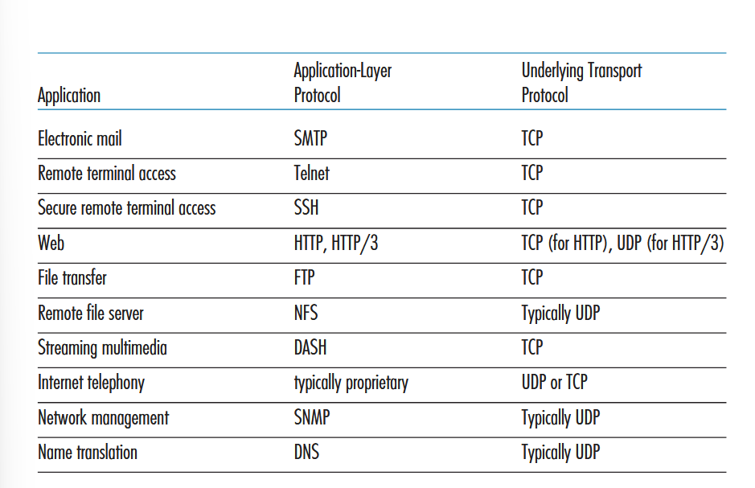

**udp can be great, but the potential congestion issues could cause issues for udp and tcp users alike**

### udp segment

header has only 4 fields -- 2 bytes each, 8 bytes total
1. source port
2. dest port
3. length -- num bytes in udp segment, header + data
4. checksum - used by recipient to check if errors introduced to segment (others use it too, but not mentioned here)

and then the data field is the message passed by application layer

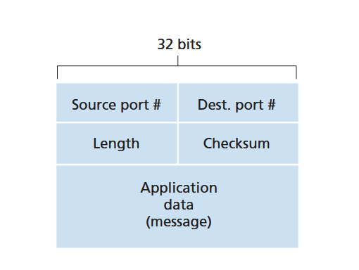

#### checksum

**error detection**

"UDP at the sender side performs the 1s complement of the sum of all the 16-bit words in the segment, with any overflow encountered during the sum being wrapped around"

**addition (3 2 byters):**

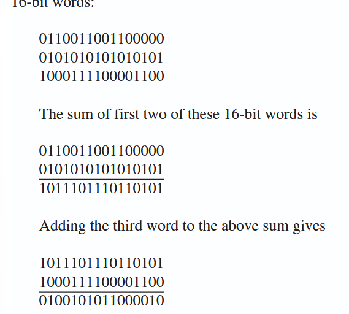
+ last addition had overflow, wrapped around

**ones compliment:**

+ obtained by converting all 0s -> 1s, 1s -> 0s
+ ^^^ this is the **checksum**!

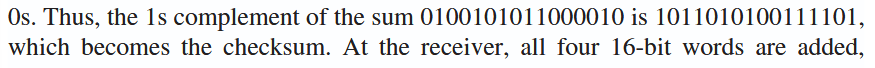

**if all 4 2byters are added and no errors, ALL ONES! 11111111....if errors, at least 1+ zero will be in the sum**

note that there is no recovery from the error, just a knowledge of it
+ some udp implementations discard the msg, some pass on with a warning

## priniciples of reliable data transfer (intro to TCP)

reliable data transfer is a big area of research in networking. for obv reasons!

**reliable data transfer** is a service abstraction provided to upper-layer entities in the form of a reliable channel; no transferred data through this channel will be corrupted, lost, and all delivered in order sent.
+ this is the responsibility of a **reliable data transfer protocol** to implement
  + typically difficult because layer below is unreliable (IP is not reliable, but TCP is)


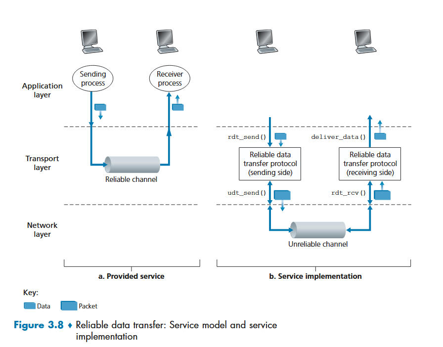

**assumption forward** -- underlying channel will not alter the order of the packets sent

the following is a generalization of computer network applications, not just transport layer applications

focus on **unidirectional data transfer** -- sender to receiver. bidirectional stems from this, but easier to talk about uni.

### rdt1.0 -- basic

**nomenclature**

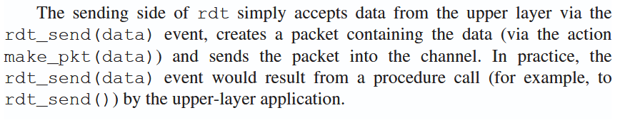

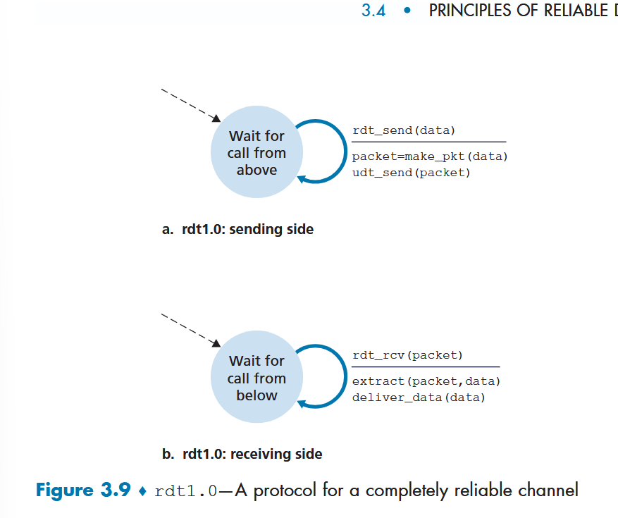
~~+ i think udt above is a typo~~
+ this is just the most basic send/receive start

### rdt2.0 -- bit errors/corruption

bit errors introduced!

**positive acknowledgements** -- "OK", the message was understand with no weirdness

**negative acknowledgments** -- reask for the data because something is messed up ("please repeat that")
+ need a repeat send
+ retransmission based protocols: **ARQ** -- automatic repeat request protocols
  + 3 capabilities required in ARQ protocols
    1. **error detection** (bit errors)
    2. **receiver feedback** (recipient ACK a request (pos acknowledgment), NAK is a neg acknowledgment)
       + these only need to be 1 bit long in principle (0/1)
    3. **retransmission** (packet receied in error will be retransmitted by sender.) 

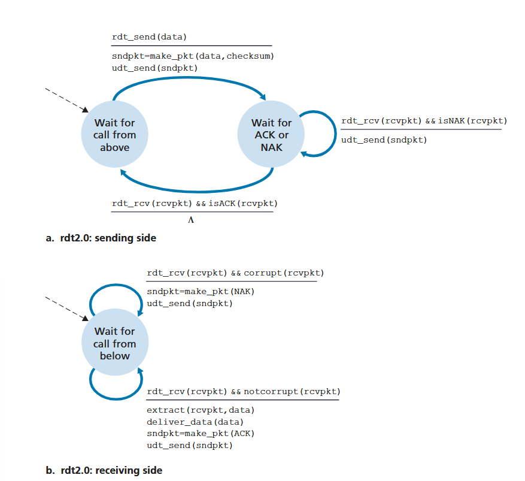
+ note above that the sender is a **stop-and-wait** protocol
  + cannot send anything else through until ACK received
+ note also that ACK/NAK can be corrupted
  + would need checksum on these as well
  + introduces some complexity that *can* be solved by simply resending a packet when getting a corrupted ACK, NAK
    + this is when **sequence numbers** on packets comes up
      + then, receiver will know if they got a duplicate packet because they recognize the sequence number in case of resend with a corrupted ack/nak

note we are just going to use 0, 1 as sequence nums for toy ex

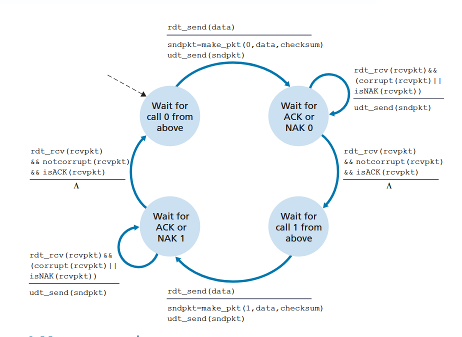

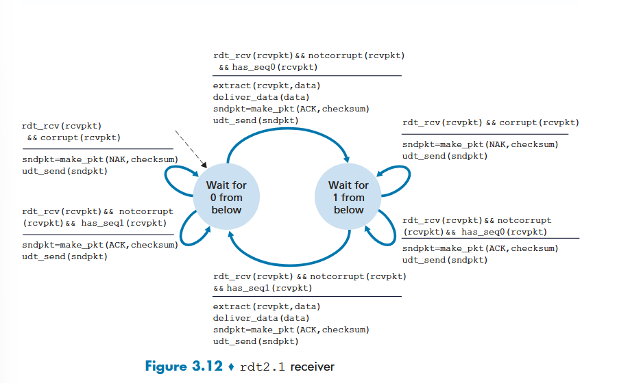

+ one further change: get rid of NAK and instead isACK takes 1/0. the idea is that the receiving machine can send back an ACK for the LAST correctly received packet, thereby the receiver getting 2 ACK's back for that last packet received correctly.
  + sender then knows the last packet sent was not received correctly, making the state NAK free.

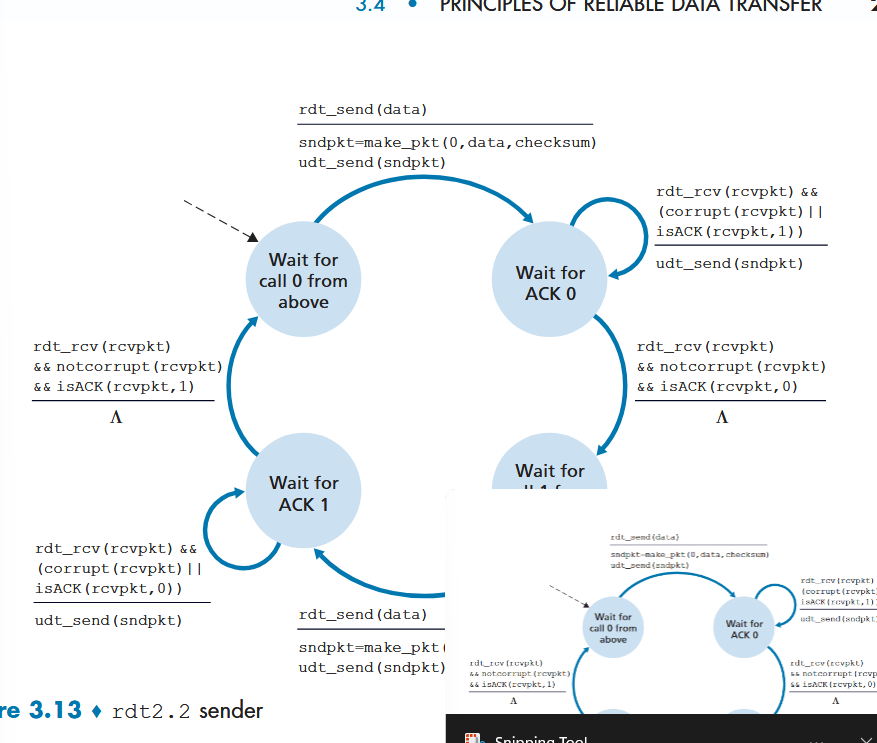

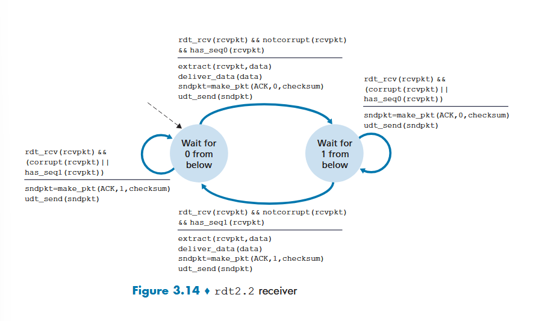

### rdt3.0 -- packets getting lost

how to detect? how to address?

**detection** -- pick a time interval (**countdown timer**) in which, if the first ACK has not been received, resend the packet. 
+ covers if data lost or ACK lost
+ sequence numbers handle duplicate data concerns
+ timer interrupts the waiting sender to retransmit

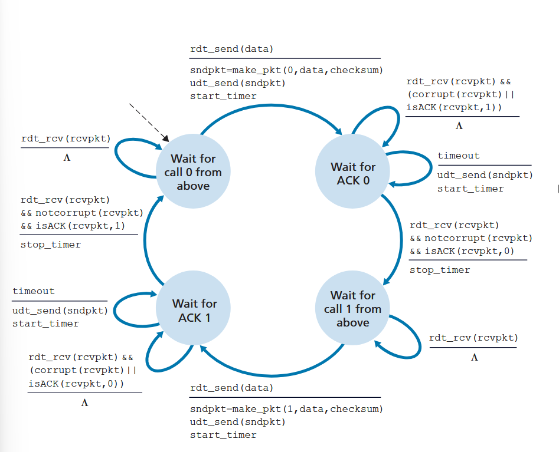

**3.0 is a working reliable data transfer protocol!**
+ performance probably not good though

### pipelined reliable data transfer protocols

*stop and wait* is mega slow and consuming

pipeline instead:

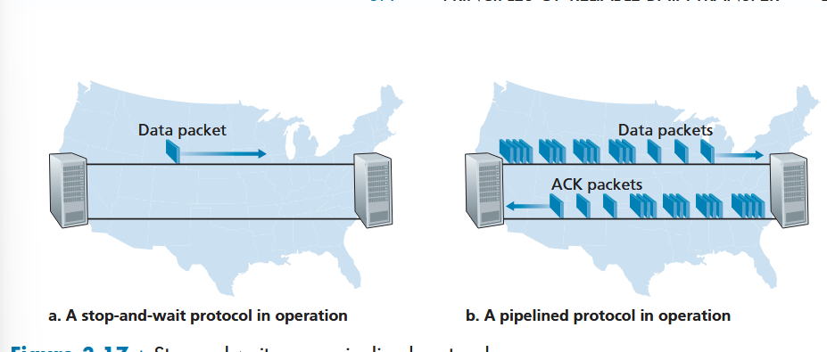

**utilization** -- fraction of ttime the sender is actually busy sending bits with respect to the time to receive an acknowledgement.
+ ex:

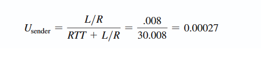
+ sender was busy 0.027% of the time it had before the ACK for the initial packet received

better util:

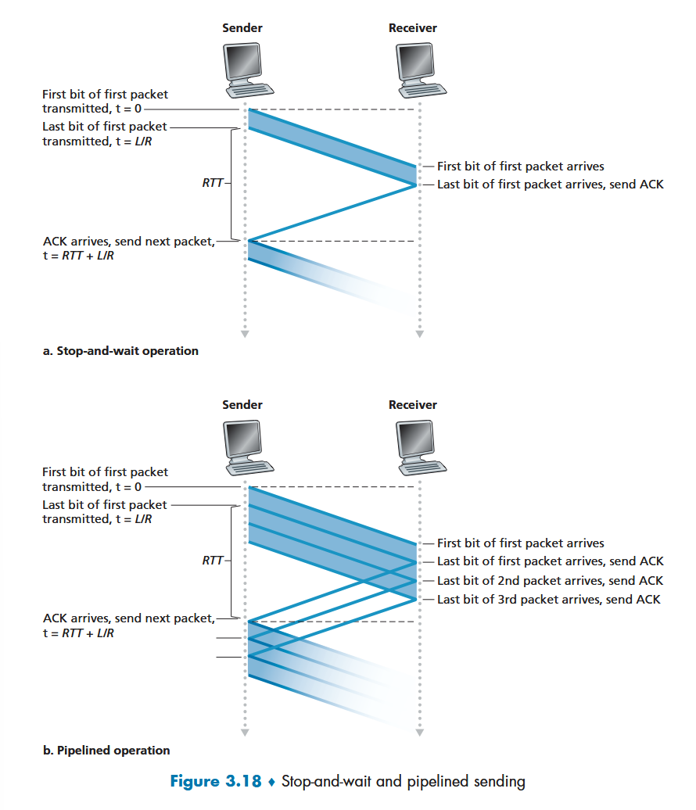

idea is we don't need to wait to send the next packet! we're wasting a ton of time.
+ we're UNDER UTILIZING the *network capability*!
  
to pipeline properly we need to
+ increase range of sequence numbers (can't be 0, 1)
  + each unique packet needs a unique seq num
+ sender/receiver may have to buffer >1 packet
+ requirement of above two changes depends on how protocol responds to lost, corrupted, delayed packets.
  + two approaches: **Go-Back-N (GBN)** and **selective repeat**

#### Go-Back-N (GBN)

+ pipelining allowed
+ constraint: cannot have more than N (set) nuber of unacknowledged packets in the pipeline

graphic of the set up, from senders perspective
+ base is oldest unack'd package

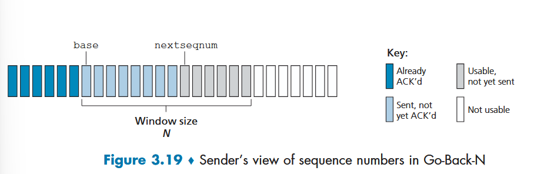
+ **sliding window protocol** -- window slides forward as ACKs come in
+ window cannot slide until BASE has been ACK'd
  + remember that we assume data is in order, so we're assuming that the ACK for the oldest packet should be gotten first?
    + but what if the base ack lost and we get another first?
    + *probable answer*: receipt of an ack is a **cumulative acknowledgement**, saying i've received **up to n sequence number**
  + **timeout**: "If a timeout occurs, the sender resends all packets that have been previously sent but that have not yet been acknowledged."
    + a single timer used, usually set by the oldest unack'd packet
+ receiver in ANY error scenario discards the packet and resends an ACK with the last recently correctly received sequence number
  + note that packets up to n have been received and delivered at that point, delivered to upper layer 1 at a time
  + receiver also discards *out of order packets*
    + if it receives n + 1, but it's expecting sequence n, it will discard n + 1 and send ack with n
      + no buffer of out of order packets, no need to because sender will def resend everything if something gets lost

out of ordering timeline

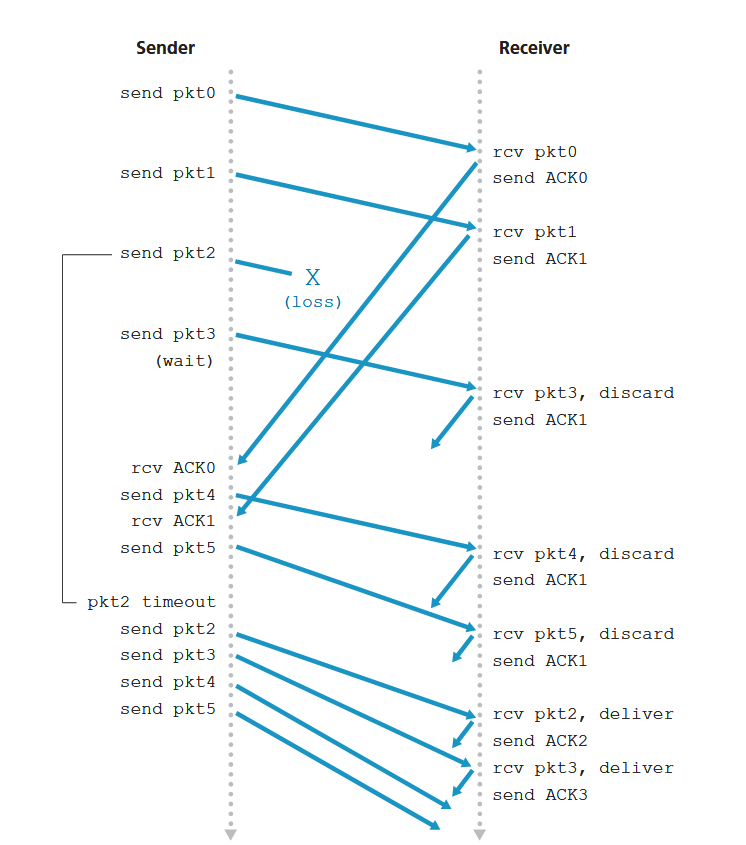
+ 345 get sent, but out of order, and ACK1 heeps getting sent, discarding them
+ timeout resends ALL unACK'd

GBN seems to be all about the timer!
+ i don't think sender does anything when it receives an ACK that's not expected, it just waits out on a timer and resends everything

#### Selective Repeat